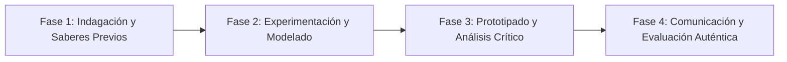

# Planeación Didáctica: Fit & Healthy Teens: Podcasting and Health Brochures in English

> [!INFO] Ficha Técnica y Curricular (NEM 2024 - Fase 6)
> - **Docente Titular:** [[Prof. Israel López Ángeles]] (`usr-teacher-1`)
> - **Nivel y Fase:** Educación Secundaria — [[Fase 6 (1º, 2º y 3º de Secundaria)]]
> - **Grado:** **2º de Secundaria**
> - **Campo Formativo:** [[Lenguajes]]
> - **Disciplina / Materia:** [[Inglés]]
> - **Contenido Sintético Oficial SEP 2024:** *Mensajes en inglés para promover una vida saludable y el deporte*
> - **MOC General:** [[00_Indice_Maestro_Secundaria_Fase6_NEM2024]]

---

## 🎯 Proceso de Desarrollo de Aprendizaje (PDA Oficial SEP 2024)
```text
Fase 6 (2º Secundaria) - Investiga en fuentes en inglés sobre nutrición y deporte para construir un folleto informativo y un guion de podcast difundido en medios escolares.
```

---

## ❓ Preguntas Detonadoras e Indagación Crítica
- **What are the best habits for physical and mental health in teenage years?**
- **How do we give healthy advice using imperatives and conditionals in English?**

---

## 📋 Secuencia Didáctica Detallada (10 Sesiones de 50 Minutos)



### 🚀 Sesiones 1 y 2: Indagación, Diagnóstico y Recuperación de Saberes
- **Inicio (15 min):** Análisis de infografías de salud de la OMS y CDC en inglés.
- **Desarrollo (30 min):** Planteamiento del reto integrador, conformación de equipos colaborativos y delimitación del alcance del proyecto.
- **Cierre (5 min):** Registro en la bitácora individual de metas de aprendizaje.

### 🔬 Sesiones 3 a 7: Desarrollo Metodológico, Trabajo Experimental y Producción
- **Inicio (10 min):** Reactivación de compromisos y revisión del cronograma de trabajo.
- **Desarrollo (35 min):** Producción de Folleto y Podcast: Redactar una guía de nutrición juvenil con recomendaciones usando "If you exercise daily, you will feel..." y grabar un audio de 1 minuto.
- **Cierre (5 min):** Coevaluación intermedia mediante lista de cotejo y retroalimentación entre pares.

### 🏁 Sesiones 8 a 10: Integración, Socialización Comunitaria y Evaluación
- **Inicio (10 min):** Ensayos de presentación y ajuste final de entregables.
- **Desarrollo (30 min):** Escucha de podcasts de salud en el aula y autoevaluación.
- **Cierre (10 min):** Metacognición grupal, balance de impacto social y firma del acta de entrega de proyectos.

---

## 📊 Rúbrica Analítica de Evaluación Formativa y Auténtica

| Nivel de Desempeño | Criterios Curriculares y Evidencias Observables | Ponderación |
| :--- | :--- | :---: |
| **Excelente (10)** | Uso del primer condicional y vocabulario de salud con fundamentación teórica sólida, rigurosa y aplicación práctica contextualizada. | 40% |
| **Satisfactorio (8-9)** | Diseño gráfico claro en el folleto de manera autónoma, estructurada y con calidad metodológica. | 35% |
| **En Proceso (6-7)** | Claridad vocal en la grabación del podcast con apoyo docente y áreas de mejora identificadas. | 25% |

---

## 📦 Materiales, Recursos Didácticos y Entregable Final

- **Materiales y Recursos:** Cartulinas, micrófonos para celular, plantillas de folletos.
- **Entregable Principal:** `Folleto Tríptico y Episodio de Podcast "Healthy Living Guide for Teens".`
- **Instrumentos de Evaluación:** Rúbrica analítica, bitácora de coevaluación entre pares, lista de verificación de entregables.

---

## 🔗 Enlaces Bidireccionales (Obsidian Knowledge Graph)
- [[00_Indice_Maestro_Secundaria_Fase6_NEM2024]]
- [[Lenguajes]]
- [[Inglés]]
- [[Secundaria_2do_Grado]]
- [[Prof_Israel_Lopez_Angeles]]
