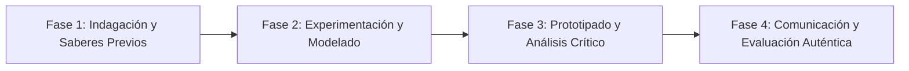

# Planeación Didáctica: El Cruce de Caminos: Métodos Gráfico, Sustitución, Igualación y Reducción

> [!INFO] Ficha Técnica y Curricular (NEM 2024 - Fase 6)
> - **Docente Titular:** [[Prof. Israel López Ángeles]] (`usr-teacher-1`)
> - **Nivel y Fase:** Educación Secundaria — [[Fase 6 (1º, 2º y 3º de Secundaria)]]
> - **Grado:** **2º de Secundaria**
> - **Campo Formativo:** [[Saberes y Pensamiento Científico]]
> - **Disciplina / Materia:** [[Matemáticas]]
> - **Contenido Sintético Oficial SEP 2024:** *Sistemas de dos ecuaciones lineales con dos incógnitas ($2 \times 2$)*
> - **MOC General:** [[00_Indice_Maestro_Secundaria_Fase6_NEM2024]]

---

## 🎯 Proceso de Desarrollo de Aprendizaje (PDA Oficial SEP 2024)
```text
Fase 6 (2º Secundaria) - Modela y soluciona sistemas de dos ecuaciones lineales con dos incógnitas por métodos algebraicos (suma y resta, sustitución, igualación) y gráfico para dar respuesta a problemas reales.
```

---

## ❓ Preguntas Detonadoras e Indagación Crítica
- **¿Cómo modelamos algebraicamente un problema de compra donde conocemos el total de artículos y el costo total de dos productos distintos?**
- **¿Qué significa geométricamente la solución de un sistema como el punto de intersección $(x, y)$ de dos rectas?**
- **¿Cuándo un sistema no tiene solución (rectas paralelas) o tiene infinitas soluciones (rectas coincidentes)?**

---

## 📋 Secuencia Didáctica Detallada (10 Sesiones de 50 Minutos)



### 🚀 Sesiones 1 y 2: Indagación, Diagnóstico y Recuperación de Saberes
- **Inicio (15 min):** Planteamiento de un acertijo de compra de boletos de cine para adultos y niños.
- **Desarrollo (30 min):** Planteamiento del reto integrador, conformación de equipos colaborativos y delimitación del alcance del proyecto.
- **Cierre (5 min):** Registro en la bitácora individual de metas de aprendizaje.

### 🔬 Sesiones 3 a 7: Desarrollo Metodológico, Trabajo Experimental y Producción
- **Inicio (10 min):** Reactivación de compromisos y revisión del cronograma de trabajo.
- **Desarrollo (35 min):** Laboratorio de Métodos Algebraicos: Resolver el mismo sistema mediante el Método Gráfico (en GeoGebra/papel milimétrico), Método de Reducción (Suma y Resta) y Sustitución.
- **Cierre (5 min):** Coevaluación intermedia mediante lista de cotejo y retroalimentación entre pares.

### 🏁 Sesiones 8 a 10: Integración, Socialización Comunitaria y Evaluación
- **Inicio (10 min):** Ensayos de presentación y ajuste final de entregables.
- **Desarrollo (30 min):** Comparación de eficiencia de métodos y resolución de problemas contextualizados.
- **Cierre (10 min):** Metacognición grupal, balance de impacto social y firma del acta de entrega de proyectos.

---

## 📊 Rúbrica Analítica de Evaluación Formativa y Auténtica

| Nivel de Desempeño | Criterios Curriculares y Evidencias Observables | Ponderación |
| :--- | :--- | :---: |
| **Excelente (10)** | Traducción de enunciados verbales a sistemas de ecuaciones lineales $2 \times 2$ con fundamentación teórica sólida, rigurosa y aplicación práctica contextualizada. | 40% |
| **Satisfactorio (8-9)** | Dominio procedimental de al menos 2 métodos algebraicos y el método gráfico de manera autónoma, estructurada y con calidad metodológica. | 35% |
| **En Proceso (6-7)** | Verificación de la solución en las ecuaciones originales con apoyo docente y áreas de mejora identificadas. | 25% |

---

## 📦 Materiales, Recursos Didácticos y Entregable Final

- **Materiales y Recursos:** Papel milimétrico, reglas, calculadora, GeoGebra en tabletas.
- **Entregable Principal:** `Dossier Comparativo de Métodos de Solución de Sistemas $2 \times 2$ con Gráficas.`
- **Instrumentos de Evaluación:** Rúbrica analítica, bitácora de coevaluación entre pares, lista de verificación de entregables.

---

## 🔗 Enlaces Bidireccionales (Obsidian Knowledge Graph)
- [[00_Indice_Maestro_Secundaria_Fase6_NEM2024]]
- [[Saberes y Pensamiento Científico]]
- [[Matemáticas]]
- [[Secundaria_2do_Grado]]
- [[Prof_Israel_Lopez_Angeles]]
