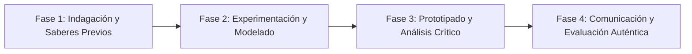

# Planeación Didáctica: El Pulso Estadístico: Media, Mediana, Moda, Rango y Desviación Media en Decisiones Comunitarias

> [!INFO] Ficha Técnica y Curricular (NEM 2024 - Fase 6)
> - **Docente Titular:** [[Prof. Israel López Ángeles]] (`usr-teacher-1`)
> - **Nivel y Fase:** Educación Secundaria — [[Fase 6 (1º, 2º y 3º de Secundaria)]]
> - **Grado:** **2º de Secundaria**
> - **Campo Formativo:** [[Saberes y Pensamiento Científico]]
> - **Disciplina / Materia:** [[Matemáticas]]
> - **Contenido Sintético Oficial SEP 2024:** *Medidas de tendencia central y de dispersión (Rango y Desviación Media)*
> - **MOC General:** [[00_Indice_Maestro_Secundaria_Fase6_NEM2024]]

---

## 🎯 Proceso de Desarrollo de Aprendizaje (PDA Oficial SEP 2024)
```text
Fase 6 (2º Secundaria) - Usa e interpreta las medidas de tendencia central (moda, media aritmética y mediana) y de dispersión (rango y desviación media) de un conjunto de datos, justificando decisiones con base en ellas.
```

---

## ❓ Preguntas Detonadoras e Indagación Crítica
- **¿Por qué la media aritmética puede ser engañosa si existen datos atípicos extremos?**
- **¿Qué nos indica la Desviación Media ($DM = \frac{\sum |x_i - \bar{x}|}{n}$) sobre la consistencia y variabilidad de un grupo?**
- **¿Cómo usamos la estadística para analizar el promedio de bateo o la confiabilidad de un servicio público?**

---

## 📋 Secuencia Didáctica Detallada (10 Sesiones de 50 Minutos)



### 🚀 Sesiones 1 y 2: Indagación, Diagnóstico y Recuperación de Saberes
- **Inicio (15 min):** Comparación de sueldos de dos empresas con el mismo promedio pero diferente dispersión.
- **Desarrollo (30 min):** Planteamiento del reto integrador, conformación de equipos colaborativos y delimitación del alcance del proyecto.
- **Cierre (5 min):** Registro en la bitácora individual de metas de aprendizaje.

### 🔬 Sesiones 3 a 7: Desarrollo Metodológico, Trabajo Experimental y Producción
- **Inicio (10 min):** Reactivación de compromisos y revisión del cronograma de trabajo.
- **Desarrollo (35 min):** Taller de Análisis Estadístico: Recopilar datos de estatura y horas de sueño del grupo, calcular media, mediana, moda, rango y desviación media, y graficar histogramas.
- **Cierre (5 min):** Coevaluación intermedia mediante lista de cotejo y retroalimentación entre pares.

### 🏁 Sesiones 8 a 10: Integración, Socialización Comunitaria y Evaluación
- **Inicio (10 min):** Ensayos de presentación y ajuste final de entregables.
- **Desarrollo (30 min):** Debate sobre la interpretación ética y crítica de estadísticas en noticias.
- **Cierre (10 min):** Metacognición grupal, balance de impacto social y firma del acta de entrega de proyectos.

---

## 📊 Rúbrica Analítica de Evaluación Formativa y Auténtica

| Nivel de Desempeño | Criterios Curriculares y Evidencias Observables | Ponderación |
| :--- | :--- | :---: |
| **Excelente (10)** | Cálculo riguroso de medidas de tendencia central y desviación media con fundamentación teórica sólida, rigurosa y aplicación práctica contextualizada. | 40% |
| **Satisfactorio (8-9)** | Interpretación del significado de la dispersión de datos de manera autónoma, estructurada y con calidad metodológica. | 35% |
| **En Proceso (6-7)** | Toma de decisiones fundamentada en evidencia estadística con apoyo docente y áreas de mejora identificadas. | 25% |

---

## 📦 Materiales, Recursos Didácticos y Entregable Final

- **Materiales y Recursos:** Hojas de cálculo, calculadoras, hojas de registro de encuestas.
- **Entregable Principal:** `Informe Estadístico Completo con Tablas de Frecuencia, Gráficas y Desviación Media.`
- **Instrumentos de Evaluación:** Rúbrica analítica, bitácora de coevaluación entre pares, lista de verificación de entregables.

---

## 🔗 Enlaces Bidireccionales (Obsidian Knowledge Graph)
- [[00_Indice_Maestro_Secundaria_Fase6_NEM2024]]
- [[Saberes y Pensamiento Científico]]
- [[Matemáticas]]
- [[Secundaria_2do_Grado]]
- [[Prof_Israel_Lopez_Angeles]]
