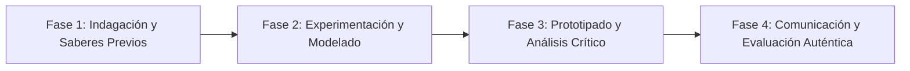

# Planeación Didáctica: El Lenguaje de la Ingeniería: Vistas Isométricas, Acotaciones y Diagramas de Flujo ANSI

> [!INFO] Ficha Técnica y Curricular (NEM 2024 - Fase 6)
> - **Docente Titular:** [[Prof. Israel López Ángeles]] (`usr-teacher-1`)
> - **Nivel y Fase:** Educación Secundaria — [[Fase 6 (1º, 2º y 3º de Secundaria)]]
> - **Grado:** **2º de Secundaria**
> - **Campo Formativo:** [[De lo Humano y lo Comunitario]]
> - **Disciplina / Materia:** [[Tecnología]]
> - **Contenido Sintético Oficial SEP 2024:** *Comunicación y representación técnica: dibujo técnico y diagramas de flujo*
> - **MOC General:** [[00_Indice_Maestro_Secundaria_Fase6_NEM2024]]

---

## 🎯 Proceso de Desarrollo de Aprendizaje (PDA Oficial SEP 2024)
```text
Fase 6 (2º Secundaria) - Elabora representaciones gráficas normalizadas de ideas y producciones técnicas (dibujo ortogonal: vista frontal, superior y lateral; dibujo isométrico a $30^{\circ}$ y diagramas de flujo de procesos).
```

---

## ❓ Preguntas Detonadoras e Indagación Crítica
- **¿Por qué el dibujo técnico es un lenguaje universal que permite a ingenieros de cualquier país fabricar la misma pieza con precisión milimétrica?**
- **¿Cómo representamos un objeto tridimensional en sus tres vistas ortogonales principales?**
- **¿Qué significan los símbolos estándar de diagramas de flujo (óvalo de inicio, rectángulo de proceso, rombo de decisión)?**

---

## 📋 Secuencia Didáctica Detallada (10 Sesiones de 50 Minutos)



### 🚀 Sesiones 1 y 2: Indagación, Diagnóstico y Recuperación de Saberes
- **Inicio (15 min):** Lectura de un plano arquitectónico o manual de ensamble de muebles.
- **Desarrollo (30 min):** Planteamiento del reto integrador, conformación de equipos colaborativos y delimitación del alcance del proyecto.
- **Cierre (5 min):** Registro en la bitácora individual de metas de aprendizaje.

### 🔬 Sesiones 3 a 7: Desarrollo Metodológico, Trabajo Experimental y Producción
- **Inicio (10 min):** Reactivación de compromisos y revisión del cronograma de trabajo.
- **Desarrollo (35 min):** Taller de Dibujo Técnico y Flujos de Proceso: Trazar con escuadras a $30^{\circ}$ la perspectiva isométrica de una pieza mecánica con acotaciones milimétricas y diseñar el diagrama de flujo algorítmico de un proceso productivo.
- **Cierre (5 min):** Coevaluación intermedia mediante lista de cotejo y retroalimentación entre pares.

### 🏁 Sesiones 8 a 10: Integración, Socialización Comunitaria y Evaluación
- **Inicio (10 min):** Ensayos de presentación y ajuste final de entregables.
- **Desarrollo (30 min):** Revisión técnica de planos con escalímetro.
- **Cierre (10 min):** Metacognición grupal, balance de impacto social y firma del acta de entrega de proyectos.

---

## 📊 Rúbrica Analítica de Evaluación Formativa y Auténtica

| Nivel de Desempeño | Criterios Curriculares y Evidencias Observables | Ponderación |
| :--- | :--- | :---: |
| **Excelente (10)** | Trazado normativo de vistas ortogonales y perspectiva isométrica a $30^{\circ}$ con fundamentación teórica sólida, rigurosa y aplicación práctica contextualizada. | 40% |
| **Satisfactorio (8-9)** | Uso correcto de líneas de cota, flechas y escalas normalizadas de manera autónoma, estructurada y con calidad metodológica. | 35% |
| **En Proceso (6-7)** | Estructuración lógica de diagramas de flujo con simbología estándar con apoyo docente y áreas de mejora identificadas. | 25% |

---

## 📦 Materiales, Recursos Didácticos y Entregable Final

- **Materiales y Recursos:** Escuadras de $30^{\circ}-60^{\circ}$ y $45^{\circ}$, escalímetro, papel milimétrico, lápiz 2H.
- **Entregable Principal:** `Lámina de Dibujo Técnico Normalizado con Vistas Diédricas y Diagrama de Flujo.`
- **Instrumentos de Evaluación:** Rúbrica analítica, bitácora de coevaluación entre pares, lista de verificación de entregables.

---

## 🔗 Enlaces Bidireccionales (Obsidian Knowledge Graph)
- [[00_Indice_Maestro_Secundaria_Fase6_NEM2024]]
- [[De lo Humano y lo Comunitario]]
- [[Tecnología]]
- [[Secundaria_2do_Grado]]
- [[Prof_Israel_Lopez_Angeles]]
