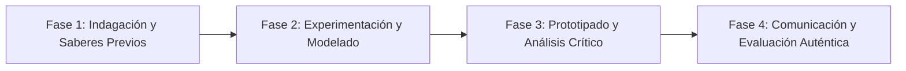

# Planeación Didáctica: Trazando Mi Rumbo: Proyecto de Vida, Metas SMART y Resiliencia ante Fracasos

> [!INFO] Ficha Técnica y Curricular (NEM 2024 - Fase 6)
> - **Docente Titular:** [[Prof. Israel López Ángeles]] (`usr-teacher-1`)
> - **Nivel y Fase:** Educación Secundaria — [[Fase 6 (1º, 2º y 3º de Secundaria)]]
> - **Grado:** **2º de Secundaria**
> - **Campo Formativo:** [[De lo Humano y lo Comunitario]]
> - **Disciplina / Materia:** [[Tutoría / Educación Socioemocional]]
> - **Contenido Sintético Oficial SEP 2024:** *Construcción del proyecto de vida y replanteamiento de metas*
> - **MOC General:** [[00_Indice_Maestro_Secundaria_Fase6_NEM2024]]

---

## 🎯 Proceso de Desarrollo de Aprendizaje (PDA Oficial SEP 2024)
```text
Fase 6 (2º Secundaria) - Analiza intereses, necesidades y logros personales para diseñar un proyecto de vida con metas SMART (específicas, medibles, alcanzables, relevantes y con tiempo límite), replanteando estrategias ante dificultades.
```

---

## ❓ Preguntas Detonadoras e Indagación Crítica
- **¿Qué metas académicas, personales y vocacionales quieres haber alcanzado al terminar la secundaria?**
- **¿Cómo transformamos un deseo vago ("quiero que me vaya bien") en una meta SMART con pasos diarios?**
- **¿Cómo convertimos un error o tropiezo en una lección de aprendizaje sin caer en el desánimo?**

---

## 📋 Secuencia Didáctica Detallada (10 Sesiones de 50 Minutos)



### 🚀 Sesiones 1 y 2: Indagación, Diagnóstico y Recuperación de Saberes
- **Inicio (15 min):** Análisis de la historia de resiliencia de Thomas Edison o Stephen Hawking.
- **Desarrollo (30 min):** Planteamiento del reto integrador, conformación de equipos colaborativos y delimitación del alcance del proyecto.
- **Cierre (5 min):** Registro en la bitácora individual de metas de aprendizaje.

### 🔬 Sesiones 3 a 7: Desarrollo Metodológico, Trabajo Experimental y Producción
- **Inicio (10 min):** Reactivación de compromisos y revisión del cronograma de trabajo.
- **Desarrollo (35 min):** Taller de Planificación Estratégica Personal: Redactar 3 metas SMART a corto plazo (este bimestre), mediano plazo (fin de ciclo) y largo plazo (elección de preparatoria), con plan de contingencia ante obstáculos.
- **Cierre (5 min):** Coevaluación intermedia mediante lista de cotejo y retroalimentación entre pares.

### 🏁 Sesiones 8 a 10: Integración, Socialización Comunitaria y Evaluación
- **Inicio (10 min):** Ensayos de presentación y ajuste final de entregables.
- **Desarrollo (30 min):** Firma de la Alianza de Compromiso Personal y entrega en sobre cerrado.
- **Cierre (10 min):** Metacognición grupal, balance de impacto social y firma del acta de entrega de proyectos.

---

## 📊 Rúbrica Analítica de Evaluación Formativa y Auténtica

| Nivel de Desempeño | Criterios Curriculares y Evidencias Observables | Ponderación |
| :--- | :--- | :---: |
| **Excelente (10)** | Formulación técnica de metas con metodología SMART con fundamentación teórica sólida, rigurosa y aplicación práctica contextualizada. | 40% |
| **Satisfactorio (8-9)** | Identificación de factores protectores y redes de apoyo familiar/escolar de manera autónoma, estructurada y con calidad metodológica. | 35% |
| **En Proceso (6-7)** | Desarrollo de actitudes de perseverancia y resiliencia con apoyo docente y áreas de mejora identificadas. | 25% |

---

## 📦 Materiales, Recursos Didácticos y Entregable Final

- **Materiales y Recursos:** Formatos de metas SMART, cronogramas de hábitos, sobres membretados.
- **Entregable Principal:** `Plan Maestro del Proyecto de Vida con Metas SMART y Matriz de Resiliencia.`
- **Instrumentos de Evaluación:** Rúbrica analítica, bitácora de coevaluación entre pares, lista de verificación de entregables.

---

## 🔗 Enlaces Bidireccionales (Obsidian Knowledge Graph)
- [[00_Indice_Maestro_Secundaria_Fase6_NEM2024]]
- [[De lo Humano y lo Comunitario]]
- [[Tutoría / Educación Socioemocional]]
- [[Secundaria_2do_Grado]]
- [[Prof_Israel_Lopez_Angeles]]
