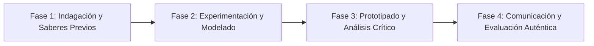

# Planeación Didáctica: Afectos Seguros: Consentimiento, Vínculos Libres de Violencia y Respeto Mutuo

> [!INFO] Ficha Técnica y Curricular (NEM 2024 - Fase 6)
> - **Docente Titular:** [[Prof. Israel López Ángeles]] (`usr-teacher-1`)
> - **Nivel y Fase:** Educación Secundaria — [[Fase 6 (1º, 2º y 3º de Secundaria)]]
> - **Grado:** **2º de Secundaria**
> - **Campo Formativo:** [[De lo Humano y lo Comunitario]]
> - **Disciplina / Materia:** [[Tutoría / Educación Socioemocional]]
> - **Contenido Sintético Oficial SEP 2024:** *Educación Integral en Sexualidad: afectividad, consentimiento y relaciones libres de violencia*
> - **MOC General:** [[00_Indice_Maestro_Secundaria_Fase6_NEM2024]]

---

## 🎯 Proceso de Desarrollo de Aprendizaje (PDA Oficial SEP 2024)
```text
Fase 6 (2º Secundaria) - Valora la importancia del consentimiento libre, informado y continuo en las relaciones interpersonales, reconociendo señales de alerta de violencia en el noviazgo y promoviendo el respeto.
```

---

## ❓ Preguntas Detonadoras e Indagación Crítica
- **¿Por qué el consentimiento debe ser libre, entusiasta, específico y puede retirarse en cualquier momento?**
- **¿Qué mitos del "amor romántico" (los celos son prueba de amor, quien te quiere te aporrea) justifican el control y la violencia?**

---

## 📋 Secuencia Didáctica Detallada (10 Sesiones de 50 Minutos)



### 🚀 Sesiones 1 y 2: Indagación, Diagnóstico y Recuperación de Saberes
- **Inicio (15 min):** Análisis de letras de canciones populares identificando mensajes de control o respeto.
- **Desarrollo (30 min):** Planteamiento del reto integrador, conformación de equipos colaborativos y delimitación del alcance del proyecto.
- **Cierre (5 min):** Registro en la bitácora individual de metas de aprendizaje.

### 🔬 Sesiones 3 a 7: Desarrollo Metodológico, Trabajo Experimental y Producción
- **Inicio (10 min):** Reactivación de compromisos y revisión del cronograma de trabajo.
- **Desarrollo (35 min):** Taller del Semáforo del Noviazgo: Clasificar conductas en Verde (confianza, libertad), Amarillo (control de celular, celos) y Rojo (gritos, amenazas, aislamiento), diseñando un violentómetro juvenil.
- **Cierre (5 min):** Coevaluación intermedia mediante lista de cotejo y retroalimentación entre pares.

### 🏁 Sesiones 8 a 10: Integración, Socialización Comunitaria y Evaluación
- **Inicio (10 min):** Ensayos de presentación y ajuste final de entregables.
- **Desarrollo (30 min):** Firma colectiva del Decálogo de Relaciones Sanas e Igualitarias.
- **Cierre (10 min):** Metacognición grupal, balance de impacto social y firma del acta de entrega de proyectos.

---

## 📊 Rúbrica Analítica de Evaluación Formativa y Auténtica

| Nivel de Desempeño | Criterios Curriculares y Evidencias Observables | Ponderación |
| :--- | :--- | :---: |
| **Excelente (10)** | Comprensión rigurosa del concepto ético y legal de consentimiento con fundamentación teórica sólida, rigurosa y aplicación práctica contextualizada. | 40% |
| **Satisfactorio (8-9)** | Identificación de indicadores tempranos de violencia de género y pareja de manera autónoma, estructurada y con calidad metodológica. | 35% |
| **En Proceso (6-7)** | Propuesta de pautas de convivencia basadas en el cuidado mutuo y la equidad con apoyo docente y áreas de mejora identificadas. | 25% |

---

## 📦 Materiales, Recursos Didácticos y Entregable Final

- **Materiales y Recursos:** Semáforos de cartulina, canciones analizadas, formatos de decálogo.
- **Entregable Principal:** `Semáforo de Relaciones Saludables y Decálogo del Respeto Afectivo Escolar.`
- **Instrumentos de Evaluación:** Rúbrica analítica, bitácora de coevaluación entre pares, lista de verificación de entregables.

---

## 🔗 Enlaces Bidireccionales (Obsidian Knowledge Graph)
- [[00_Indice_Maestro_Secundaria_Fase6_NEM2024]]
- [[De lo Humano y lo Comunitario]]
- [[Tutoría / Educación Socioemocional]]
- [[Secundaria_2do_Grado]]
- [[Prof_Israel_Lopez_Angeles]]
