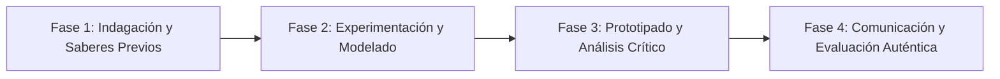

# Planeación Didáctica: Espejo Real: Desmontando la Presión Estética, Redes Sociales y Prevención de Anorexia/Bulimia

> [!INFO] Ficha Técnica y Curricular (NEM 2024 - Fase 6)
> - **Docente Titular:** [[Prof. Israel López Ángeles]] (`usr-teacher-1`)
> - **Nivel y Fase:** Educación Secundaria — [[Fase 6 (1º, 2º y 3º de Secundaria)]]
> - **Grado:** **2º de Secundaria**
> - **Campo Formativo:** [[De lo Humano y lo Comunitario]]
> - **Disciplina / Materia:** [[Tutoría / Educación Socioemocional]]
> - **Contenido Sintético Oficial SEP 2024:** *Cuidado de la imagen corporal y prevención de trastornos alimentarios (TCA)*
> - **MOC General:** [[00_Indice_Maestro_Secundaria_Fase6_NEM2024]]

---

## 🎯 Proceso de Desarrollo de Aprendizaje (PDA Oficial SEP 2024)
```text
Fase 6 (2º Secundaria) - Analiza críticamente los filtros digitales y la presión estética en redes sociales, reconociendo factores de riesgo de Trastornos de la Conducta Alimentaria (anorexia, bulimia, vigorexia) y cultivando la autoaceptación corporal.
```

---

## ❓ Preguntas Detonadoras e Indagación Crítica
- **¿Cómo los filtros de belleza y cuerpos retocados con Photoshop crean expectativas irreales que dañan la autoestima de los jóvenes?**
- **¿Cuáles son los síntomas de alerta de los TCA y por qué son enfermedades graves que requieren atención médica urgente?**

---

## 📋 Secuencia Didáctica Detallada (10 Sesiones de 50 Minutos)



### 🚀 Sesiones 1 y 2: Indagación, Diagnóstico y Recuperación de Saberes
- **Inicio (15 min):** Comparación de fotos originales vs editadas con filtros de retoque facial y corporal.
- **Desarrollo (30 min):** Planteamiento del reto integrador, conformación de equipos colaborativos y delimitación del alcance del proyecto.
- **Cierre (5 min):** Registro en la bitácora individual de metas de aprendizaje.

### 🔬 Sesiones 3 a 7: Desarrollo Metodológico, Trabajo Experimental y Producción
- **Inicio (10 min):** Reactivación de compromisos y revisión del cronograma de trabajo.
- **Desarrollo (35 min):** Taller de Amor Propio y Diversidad Corporal: Redactar una carta de gratitud a nuestro cuerpo por todo lo que nos permite hacer (caminar, abrazar, reír, bailar) y diseñar carteles de desmitificación de la delgadez extrema.
- **Cierre (5 min):** Coevaluación intermedia mediante lista de cotejo y retroalimentación entre pares.

### 🏁 Sesiones 8 a 10: Integración, Socialización Comunitaria y Evaluación
- **Inicio (10 min):** Ensayos de presentación y ajuste final de entregables.
- **Desarrollo (30 min):** Mural de Espejos Positivos con mensajes de autoaceptación incondicional.
- **Cierre (10 min):** Metacognición grupal, balance de impacto social y firma del acta de entrega de proyectos.

---

## 📊 Rúbrica Analítica de Evaluación Formativa y Auténtica

| Nivel de Desempeño | Criterios Curriculares y Evidencias Observables | Ponderación |
| :--- | :--- | :---: |
| **Excelente (10)** | Pensamiento crítico frente a cánones estéticos impuestos por la publicidad con fundamentación teórica sólida, rigurosa y aplicación práctica contextualizada. | 40% |
| **Satisfactorio (8-9)** | Identificación de señales de riesgo de trastornos alimentarios de manera autónoma, estructurada y con calidad metodológica. | 35% |
| **En Proceso (6-7)** | Promoción de la diversidad corporal y la salud integral con apoyo docente y áreas de mejora identificadas. | 25% |

---

## 📦 Materiales, Recursos Didácticos y Entregable Final

- **Materiales y Recursos:** Imágenes comparativas, espejos didácticos, cartulinas fluorescentes.
- **Entregable Principal:** `Campaña Escolar Ilustrada "Cuerpos Reales, Salud Integral: Sin Filtros".`
- **Instrumentos de Evaluación:** Rúbrica analítica, bitácora de coevaluación entre pares, lista de verificación de entregables.

---

## 🔗 Enlaces Bidireccionales (Obsidian Knowledge Graph)
- [[00_Indice_Maestro_Secundaria_Fase6_NEM2024]]
- [[De lo Humano y lo Comunitario]]
- [[Tutoría / Educación Socioemocional]]
- [[Secundaria_2do_Grado]]
- [[Prof_Israel_Lopez_Angeles]]
