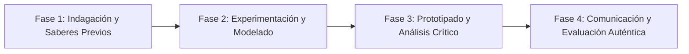

# Planeación Didáctica: La Mirada Filosófica del Arte: Categorías Estéticas y Fotografía Narrativa

> [!INFO] Ficha Técnica y Curricular (NEM 2024 - Fase 6)
> - **Docente Titular:** [[Prof. Israel López Ángeles]] (`usr-teacher-1`)
> - **Nivel y Fase:** Educación Secundaria — [[Fase 6 (1º, 2º y 3º de Secundaria)]]
> - **Grado:** **3º de Secundaria**
> - **Campo Formativo:** [[Lenguajes]]
> - **Disciplina / Materia:** [[Artes]]
> - **Contenido Sintético Oficial SEP 2024:** *Valor estético de la naturaleza y categorías estéticas (lo sublime, lo grotesco, lo trágico, lo cómico)*
> - **MOC General:** [[00_Indice_Maestro_Secundaria_Fase6_NEM2024]]

---

## 🎯 Proceso de Desarrollo de Aprendizaje (PDA Oficial SEP 2024)
```text
Fase 6 (3º Secundaria) - Identifica y argumenta categorías estéticas como lo bello, lo sublime, lo grotesco, lo trágico, lo cómico y lo siniestro, al apreciarlas en manifestaciones artísticas, la naturaleza y la vida cotidiana.
```

---

## ❓ Preguntas Detonadoras e Indagación Crítica
- **¿Qué diferencia a lo BELLO (armónico) de lo SUBLIME (la majestuosidad imponente de una tormenta o volcán que asombra y estremece)?**
- **¿Por qué el arte a veces utiliza lo GROTESCO o lo TRÁGICO para despertar la conciencia humana?**
- **¿Cómo capturamos con una cámara fotográfica o dibujo un instante cotidiano cargado de belleza o dramatismo?**
- **¿Cómo defendemos con argumentos filosóficos nuestro juicio estético sobre una obra?**

---

## 📋 Secuencia Didáctica Detallada (10 Sesiones de 50 Minutos)



### 🚀 Sesiones 1 y 2: Indagación, Diagnóstico y Recuperación de Saberes
- **Inicio (15 min):** Proyección de pinturas clásicas y fotografías de la naturaleza ilustrando las 6 categorías estéticas.
- **Desarrollo (30 min):** Planteamiento del reto integrador, conformación de equipos colaborativos y delimitación del alcance del proyecto.
- **Cierre (5 min):** Registro en la bitácora individual de metas de aprendizaje.

### 🔬 Sesiones 3 a 7: Desarrollo Metodológico, Trabajo Experimental y Producción
- **Inicio (10 min):** Reactivación de compromisos y revisión del cronograma de trabajo.
- **Desarrollo (35 min):** Taller de Fotografía y Juicio Estético: Tomar 4 fotografías en el entorno escolar/comunitario que ejemplifiquen categorías distintas (ej. Lo bello en una flor, lo sublime en un cielo nublado, lo cómico en un juego) y redactar el ensayo curatorial.
- **Cierre (5 min):** Coevaluación intermedia mediante lista de cotejo y retroalimentación entre pares.

### 🏁 Sesiones 8 a 10: Integración, Socialización Comunitaria y Evaluación
- **Inicio (10 min):** Ensayos de presentación y ajuste final de entregables.
- **Desarrollo (30 min):** Exposición Fotográfica "Las Seis Miradas del Arte" y debate estético.
- **Cierre (10 min):** Metacognición grupal, balance de impacto social y firma del acta de entrega de proyectos.

---

## 📊 Rúbrica Analítica de Evaluación Formativa y Auténtica

| Nivel de Desempeño | Criterios Curriculares y Evidencias Observables | Ponderación |
| :--- | :--- | :---: |
| **Excelente (10)** | Comprensión rigurosa de las categorías estéticas filosóficas con fundamentación teórica sólida, rigurosa y aplicación práctica contextualizada. | 40% |
| **Satisfactorio (8-9)** | Calidad compositiva fotográfica (encuadre, iluminación, plano) de manera autónoma, estructurada y con calidad metodológica. | 35% |
| **En Proceso (6-7)** | Argumentación conceptual y justificación teórica en el ensayo con apoyo docente y áreas de mejora identificadas. | 25% |

---

## 📦 Materiales, Recursos Didácticos y Entregable Final

- **Materiales y Recursos:** Cámaras de celular, papel fotográfico o impresiones, cartulina negra para montaje.
- **Entregable Principal:** `Serie Fotográfica Curada de 4 Obras con Ensayo Filosófico de Juicio Estético.`
- **Instrumentos de Evaluación:** Rúbrica analítica, bitácora de coevaluación entre pares, lista de verificación de entregables.

---

## 🔗 Enlaces Bidireccionales (Obsidian Knowledge Graph)
- [[00_Indice_Maestro_Secundaria_Fase6_NEM2024]]
- [[Lenguajes]]
- [[Artes]]
- [[Secundaria_3er_Grado]]
- [[Prof_Israel_Lopez_Angeles]]
