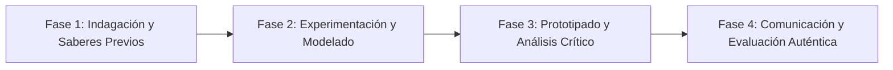

# Planeación Didáctica: El Arte que Rompe el Silencio: Lengua de Señas Mexicana, Braille y Pintura Táctil

> [!INFO] Ficha Técnica y Curricular (NEM 2024 - Fase 6)
> - **Docente Titular:** [[Prof. Israel López Ángeles]] (`usr-teacher-1`)
> - **Nivel y Fase:** Educación Secundaria — [[Fase 6 (1º, 2º y 3º de Secundaria)]]
> - **Grado:** **3º de Secundaria**
> - **Campo Formativo:** [[Lenguajes]]
> - **Disciplina / Materia:** [[Artes]]
> - **Contenido Sintético Oficial SEP 2024:** *Sistemas alternativos y aumentativos de comunicación como herramientas creativas de inclusión*
> - **MOC General:** [[00_Indice_Maestro_Secundaria_Fase6_NEM2024]]

---

## 🎯 Proceso de Desarrollo de Aprendizaje (PDA Oficial SEP 2024)
```text
Fase 6 (3º Secundaria) - Crea códigos y obras que favorecen la inclusión a través del uso artístico de texturas, formas, movimientos corporales, Lengua de Señas Mexicana (LSM) y sistema Braille, para sensibilizar sobre la diversidad.
```

---

## ❓ Preguntas Detonadoras e Indagación Crítica
- **¿Cómo percibe el arte una persona con discapacidad visual a través del tacto y las texturas en relieve?**
- **¿De qué manera la Lengua de Señas Mexicana (LSM) es una danza expresiva de manos, gestos y espacio tridimensional?**
- **¿Cómo incorporamos el alfabeto Braille en una pintura para que sea accesible a personas ciegas?**
- **¿Por qué una sociedad verdaderamente culta es aquella que garantiza accesibilidad universal en todos los museos y escuelas?**

---

## 📋 Secuencia Didáctica Detallada (10 Sesiones de 50 Minutos)



### 🚀 Sesiones 1 y 2: Indagación, Diagnóstico y Recuperación de Saberes
- **Inicio (15 min):** Experiencia sensorial con ojos vendados: Reconocimiento táctil de relieves y texturas. Aprendizaje del dactilológico LSM.
- **Desarrollo (30 min):** Planteamiento del reto integrador, conformación de equipos colaborativos y delimitación del alcance del proyecto.
- **Cierre (5 min):** Registro en la bitácora individual de metas de aprendizaje.

### 🔬 Sesiones 3 a 7: Desarrollo Metodológico, Trabajo Experimental y Producción
- **Inicio (10 min):** Reactivación de compromisos y revisión del cronograma de trabajo.
- **Desarrollo (35 min):** Taller de Arte Háptico y Táctil: Crear una pintura táctil utilizando arena, semillas, estambre y pasta de relieve, incorporando un poema en sistema Braille punteado a mano y señas de LSM.
- **Cierre (5 min):** Coevaluación intermedia mediante lista de cotejo y retroalimentación entre pares.

### 🏁 Sesiones 8 a 10: Integración, Socialización Comunitaria y Evaluación
- **Inicio (10 min):** Ensayos de presentación y ajuste final de entregables.
- **Desarrollo (30 min):** Recorrido sensorial con antifaces en el "Museo Inclusivo de Arte Táctil". Metacognición.
- **Cierre (10 min):** Metacognición grupal, balance de impacto social y firma del acta de entrega de proyectos.

---

## 📊 Rúbrica Analítica de Evaluación Formativa y Auténtica

| Nivel de Desempeño | Criterios Curriculares y Evidencias Observables | Ponderación |
| :--- | :--- | :---: |
| **Excelente (10)** | Integración armónica de sistemas aumentativos (LSM y Braille) en la obra con fundamentación teórica sólida, rigurosa y aplicación práctica contextualizada. | 40% |
| **Satisfactorio (8-9)** | Calidad técnica en el diseño de texturas táctiles y relieve háptico de manera autónoma, estructurada y con calidad metodológica. | 35% |
| **En Proceso (6-7)** | Sensibilidad y compromiso ético con la accesibilidad y la inclusión social con apoyo docente y áreas de mejora identificadas. | 25% |

---

## 📦 Materiales, Recursos Didácticos y Entregable Final

- **Materiales y Recursos:** Cartón grueso, arena fina, plastilina, semillas, punzones para Braille, antifaces.
- **Entregable Principal:** `Cuadro de Arte Táctil Accesible con Poema en Braille y Traducción a Lengua de Señas Mexicana.`
- **Instrumentos de Evaluación:** Rúbrica analítica, bitácora de coevaluación entre pares, lista de verificación de entregables.

---

## 🔗 Enlaces Bidireccionales (Obsidian Knowledge Graph)
- [[00_Indice_Maestro_Secundaria_Fase6_NEM2024]]
- [[Lenguajes]]
- [[Artes]]
- [[Secundaria_3er_Grado]]
- [[Prof_Israel_Lopez_Angeles]]
