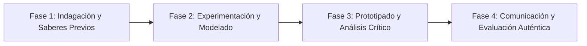

# Planeación Didáctica: El Ojo del Curador: Montaje, Museografía y Cédulas de una Exposición Escolar

> [!INFO] Ficha Técnica y Curricular (NEM 2024 - Fase 6)
> - **Docente Titular:** [[Prof. Israel López Ángeles]] (`usr-teacher-1`)
> - **Nivel y Fase:** Educación Secundaria — [[Fase 6 (1º, 2º y 3º de Secundaria)]]
> - **Grado:** **3º de Secundaria**
> - **Campo Formativo:** [[Lenguajes]]
> - **Disciplina / Materia:** [[Artes]]
> - **Contenido Sintético Oficial SEP 2024:** *Curaduría y montaje de exposiciones de artes visuales*
> - **MOC General:** [[00_Indice_Maestro_Secundaria_Fase6_NEM2024]]

---

## 🎯 Proceso de Desarrollo de Aprendizaje (PDA Oficial SEP 2024)
```text
Fase 6 (3º Secundaria) - Diseña y monta una exposición artística colectiva en la escuela, aplicando principios museográficos (recorrido, iluminación, alturas de montaje, cédulas y catálogo razonado).
```

---

## ❓ Preguntas Detonadoras e Indagación Crítica
- **¿Qué labor realiza un curador de arte para que una exposición cuente una historia coherente?**
- **¿Cómo se redacta una cédula de sala y de obra con datos técnicos y ficha analítica?**

---

## 📋 Secuencia Didáctica Detallada (10 Sesiones de 50 Minutos)



### 🚀 Sesiones 1 y 2: Indagación, Diagnóstico y Recuperación de Saberes
- **Inicio (15 min):** Recorrido virtual por el Museo Nacional de Arte (MUNAL) observando la museografía.
- **Desarrollo (30 min):** Planteamiento del reto integrador, conformación de equipos colaborativos y delimitación del alcance del proyecto.
- **Cierre (5 min):** Registro en la bitácora individual de metas de aprendizaje.

### 🔬 Sesiones 3 a 7: Desarrollo Metodológico, Trabajo Experimental y Producción
- **Inicio (10 min):** Reactivación de compromisos y revisión del cronograma de trabajo.
- **Desarrollo (35 min):** Comité Curatorial: Seleccionar 20 obras de los alumnos, diseñar el plano de distribución en la galería escolar, redactar las cédulas de sala y montar las obras a la altura estándar (1.50 m).
- **Cierre (5 min):** Coevaluación intermedia mediante lista de cotejo y retroalimentación entre pares.

### 🏁 Sesiones 8 a 10: Integración, Socialización Comunitaria y Evaluación
- **Inicio (10 min):** Ensayos de presentación y ajuste final de entregables.
- **Desarrollo (30 min):** Inauguración formal de la Exposición Anual de Artes con visita guiada para padres y alumnos.
- **Cierre (10 min):** Metacognición grupal, balance de impacto social y firma del acta de entrega de proyectos.

---

## 📊 Rúbrica Analítica de Evaluación Formativa y Auténtica

| Nivel de Desempeño | Criterios Curriculares y Evidencias Observables | Ponderación |
| :--- | :--- | :---: |
| **Excelente (10)** | Aplicación rigurosa de principios museográficos y de conservación con fundamentación teórica sólida, rigurosa y aplicación práctica contextualizada. | 40% |
| **Satisfactorio (8-9)** | Redacción académica de textos de sala y cédulas de obra de manera autónoma, estructurada y con calidad metodológica. | 35% |
| **En Proceso (6-7)** | Trabajo colaborativo en la gestión y difusión cultural con apoyo docente y áreas de mejora identificadas. | 25% |

---

## 📦 Materiales, Recursos Didácticos y Entregable Final

- **Materiales y Recursos:** Nivel de gota, cinta métrica, clavillos, paspartú, catálogo impreso.
- **Entregable Principal:** `Catálogo de Exposición Artística Escolar y Montaje Museográfico Concluido.`
- **Instrumentos de Evaluación:** Rúbrica analítica, bitácora de coevaluación entre pares, lista de verificación de entregables.

---

## 🔗 Enlaces Bidireccionales (Obsidian Knowledge Graph)
- [[00_Indice_Maestro_Secundaria_Fase6_NEM2024]]
- [[Lenguajes]]
- [[Artes]]
- [[Secundaria_3er_Grado]]
- [[Prof_Israel_Lopez_Angeles]]
