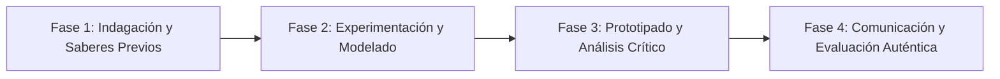

# Planeación Didáctica: Innovadores STEM: Diseño, Construcción y Evaluación de un Filtro Purificador de Agua Comunitario

> [!INFO] Ficha Técnica y Curricular (NEM 2024 - Fase 6)
> - **Docente Titular:** [[Prof. Israel López Ángeles]] (`usr-teacher-1`)
> - **Nivel y Fase:** Educación Secundaria — [[Fase 6 (1º, 2º y 3º de Secundaria)]]
> - **Grado:** **3º de Secundaria**
> - **Campo Formativo:** [[Saberes y Pensamiento Científico]]
> - **Disciplina / Materia:** [[Saberes / Ciencias]]
> - **Contenido Sintético Oficial SEP 2024:** *Proyecto integrador STEM: Solución tecnológica a un problema ambiental escolar*
> - **MOC General:** [[00_Indice_Maestro_Secundaria_Fase6_NEM2024]]

---

## 🎯 Proceso de Desarrollo de Aprendizaje (PDA Oficial SEP 2024)
```text
Fase 6 (3º Secundaria) - Integra saberes de Matemáticas, Biología, Física y Química en un proyecto STEM para diseñar, construir y evaluar un sistema de captación y purificación de agua de lluvia en la escuela.
```

---

## ❓ Preguntas Detonadoras e Indagación Crítica
- **¿Cómo integramos la química de coagulantes, la física de filtración, la biología de desinfección y el cálculo de volumen en un purificador?**
- **¿Cómo validamos la potabilidad del agua filtrada?**

---

## 📋 Secuencia Didáctica Detallada (10 Sesiones de 50 Minutos)



### 🚀 Sesiones 1 y 2: Indagación, Diagnóstico y Recuperación de Saberes
- **Inicio (15 min):** Medición de la turbidez y pH del agua de lluvia recolectada en la azotea escolar.
- **Desarrollo (30 min):** Planteamiento del reto integrador, conformación de equipos colaborativos y delimitación del alcance del proyecto.
- **Cierre (5 min):** Registro en la bitácora individual de metas de aprendizaje.

### 🔬 Sesiones 3 a 7: Desarrollo Metodológico, Trabajo Experimental y Producción
- **Inicio (10 min):** Reactivación de compromisos y revisión del cronograma de trabajo.
- **Desarrollo (35 min):** Construcción del Filtro de Múltiples Lechos: En una columna transparente, colocar capas calibradas de grava, arena sílice, carbón activado y algodón, realizando pruebas de caudal ($Q = V/t$), turbidez y eliminación de patógenos con luz UV solar (método SODIS).
- **Cierre (5 min):** Coevaluación intermedia mediante lista de cotejo y retroalimentación entre pares.

### 🏁 Sesiones 8 a 10: Integración, Socialización Comunitaria y Evaluación
- **Inicio (10 min):** Ensayos de presentación y ajuste final de entregables.
- **Desarrollo (30 min):** Inauguración del Sistema Demostrativo de Captación Pluvial Escolar.
- **Cierre (10 min):** Metacognición grupal, balance de impacto social y firma del acta de entrega de proyectos.

---

## 📊 Rúbrica Analítica de Evaluación Formativa y Auténtica

| Nivel de Desempeño | Criterios Curriculares y Evidencias Observables | Ponderación |
| :--- | :--- | :---: |
| **Excelente (10)** | Integración interdisciplinaria rigurosa de las 4 ciencias con fundamentación teórica sólida, rigurosa y aplicación práctica contextualizada. | 40% |
| **Satisfactorio (8-9)** | Eficiencia funcional y calidad del agua filtrada de manera autónoma, estructurada y con calidad metodológica. | 35% |
| **En Proceso (6-7)** | Documentación técnica completa del proyecto STEM con apoyo docente y áreas de mejora identificadas. | 25% |

---

## 📦 Materiales, Recursos Didácticos y Entregable Final

- **Materiales y Recursos:** Botellones de 20L, arena sílice, carbón activado, grava, algodón, tiras de prueba.
- **Entregable Principal:** `Prototipo Funcional de Purificador de Agua y Memoria Técnica del Proyecto STEM.`
- **Instrumentos de Evaluación:** Rúbrica analítica, bitácora de coevaluación entre pares, lista de verificación de entregables.

---

## 🔗 Enlaces Bidireccionales (Obsidian Knowledge Graph)
- [[00_Indice_Maestro_Secundaria_Fase6_NEM2024]]
- [[Saberes y Pensamiento Científico]]
- [[Saberes / Ciencias]]
- [[Secundaria_3er_Grado]]
- [[Prof_Israel_Lopez_Angeles]]
