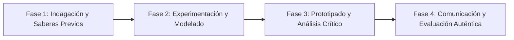

# Planeación Didáctica: Juego Limpio: Organización de la Liga Escolar Mixta, Arbitraje y Convivencia Pacífica

> [!INFO] Ficha Técnica y Curricular (NEM 2024 - Fase 6)
> - **Docente Titular:** [[Prof. Israel López Ángeles]] (`usr-teacher-1`)
> - **Nivel y Fase:** Educación Secundaria — [[Fase 6 (1º, 2º y 3º de Secundaria)]]
> - **Grado:** **3º de Secundaria**
> - **Campo Formativo:** [[De lo Humano y lo Comunitario]]
> - **Disciplina / Materia:** [[Educación Física]]
> - **Contenido Sintético Oficial SEP 2024:** *Organización de torneos deportivos escolares, arbitraje y Juego Limpio (Fair Play)*
> - **MOC General:** [[00_Indice_Maestro_Secundaria_Fase6_NEM2024]]

---

## 🎯 Proceso de Desarrollo de Aprendizaje (PDA Oficial SEP 2024)
```text
Fase 6 (3º Secundaria) - Diseña, organiza y evalúa torneos deportivos recreativos y de deporte educativo con equipos mixtos, aplicando reglamentos oficiales, arbitraje imparcial y códigos de Fair Play.
```

---

## ❓ Preguntas Detonadoras e Indagación Crítica
- **¿Cómo organizamos un torneo de liga escolar con sistema de todos contra todos (Round Robin) y eliminación directa?**
- **¿Por qué la figura del árbitro merece respeto absoluto y cómo se ejerce un arbitraje justo y sereno?**
- **¿Cómo erradicamos la violencia verbal y física en las porras y en el terreno de juego?**

---

## 📋 Secuencia Didáctica Detallada (10 Sesiones de 50 Minutos)



### 🚀 Sesiones 1 y 2: Indagación, Diagnóstico y Recuperación de Saberes
- **Inicio (15 min):** Firma del Juramento Deportivo del Atleta y Árbitro del Torneo de 3º Grado.
- **Desarrollo (30 min):** Planteamiento del reto integrador, conformación de equipos colaborativos y delimitación del alcance del proyecto.
- **Cierre (5 min):** Registro en la bitácora individual de metas de aprendizaje.

### 🔬 Sesiones 3 a 7: Desarrollo Metodológico, Trabajo Experimental y Producción
- **Inicio (10 min):** Reactivación de compromisos y revisión del cronograma de trabajo.
- **Desarrollo (35 min):** Comités de Organización Deportiva: Organizar 4 comisiones (1. Comité Técnico y Rol de Juegos, 2. Cuerpo de Árbitros y Jueces de Mesa, 3. Brigada de Primeros Auxilios e Hidratación, 4. Comité de Prensa y Fair Play) para operar la Liga Escolar Mixta.
- **Cierre (5 min):** Coevaluación intermedia mediante lista de cotejo y retroalimentación entre pares.

### 🏁 Sesiones 8 a 10: Integración, Socialización Comunitaria y Evaluación
- **Inicio (10 min):** Ensayos de presentación y ajuste final de entregables.
- **Desarrollo (30 min):** Ceremonia de clausura y entrega de la Copa al Juego Limpio y Compañerismo.
- **Cierre (10 min):** Metacognición grupal, balance de impacto social y firma del acta de entrega de proyectos.

---

## 📊 Rúbrica Analítica de Evaluación Formativa y Auténtica

| Nivel de Desempeño | Criterios Curriculares y Evidencias Observables | Ponderación |
| :--- | :--- | :---: |
| **Excelente (10)** | Gestión y organización autónoma del torneo deportivo escolar con fundamentación teórica sólida, rigurosa y aplicación práctica contextualizada. | 40% |
| **Satisfactorio (8-9)** | Aplicación rigurosa del reglamento deportivo y arbitraje imparcial de manera autónoma, estructurada y con calidad metodológica. | 35% |
| **En Proceso (6-7)** | Promoción activa del Fair Play y resolución pacífica de controversias con apoyo docente y áreas de mejora identificadas. | 25% |

---

## 📦 Materiales, Recursos Didácticos y Entregable Final

- **Materiales y Recursos:** Cédulas de arbitraje, cronómetros, silbatos, balones, botiquín deportivo, trofeo simbólico.
- **Entregable Principal:** `Convocatoria Oficial, Cédulas de Arbitraje y Memoria de la Liga Deportiva Mixta.`
- **Instrumentos de Evaluación:** Rúbrica analítica, bitácora de coevaluación entre pares, lista de verificación de entregables.

---

## 🔗 Enlaces Bidireccionales (Obsidian Knowledge Graph)
- [[00_Indice_Maestro_Secundaria_Fase6_NEM2024]]
- [[De lo Humano y lo Comunitario]]
- [[Educación Física]]
- [[Secundaria_3er_Grado]]
- [[Prof_Israel_Lopez_Angeles]]
