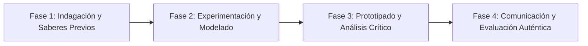

# Planeación Didáctica: Brigada de Rescate: Primeros Auxilios Deportivos, RICE, Vendajes y RCP Básica

> [!INFO] Ficha Técnica y Curricular (NEM 2024 - Fase 6)
> - **Docente Titular:** [[Prof. Israel López Ángeles]] (`usr-teacher-1`)
> - **Nivel y Fase:** Educación Secundaria — [[Fase 6 (1º, 2º y 3º de Secundaria)]]
> - **Grado:** **3º de Secundaria**
> - **Campo Formativo:** [[De lo Humano y lo Comunitario]]
> - **Disciplina / Materia:** [[Educación Física]]
> - **Contenido Sintético Oficial SEP 2024:** *Primeros auxilios básicos en actividades deportivas y escolares*
> - **MOC General:** [[00_Indice_Maestro_Secundaria_Fase6_NEM2024]]

---

## 🎯 Proceso de Desarrollo de Aprendizaje (PDA Oficial SEP 2024)
```text
Fase 6 (3º Secundaria) - Aplica protocolos de primeros auxilios ante lesiones deportivas comunes (esguinces, calambres, desmayos, insolación) aplicando el protocolo RICE y la maniobra de Heimlich y RCP básica.
```

---

## ❓ Preguntas Detonadoras e Indagación Crítica
- **¿Cómo aplicamos el protocolo RICE (Reposo, Hielo, Compresión, Elevación) ante una torcedura de tobillo en la cancha?**
- **¿Cómo se realiza la Maniobra de Heimlich para salvar la vida de alguien que se está atragantando?**

---

## 📋 Secuencia Didáctica Detallada (10 Sesiones de 50 Minutos)



### 🚀 Sesiones 1 y 2: Indagación, Diagnóstico y Recuperación de Saberes
- **Inicio (15 min):** Demostración de la cadena de supervivencia y llamada al 911 con datos precisos.
- **Desarrollo (30 min):** Planteamiento del reto integrador, conformación de equipos colaborativos y delimitación del alcance del proyecto.
- **Cierre (5 min):** Registro en la bitácora individual de metas de aprendizaje.

### 🔬 Sesiones 3 a 7: Desarrollo Metodológico, Trabajo Experimental y Producción
- **Inicio (10 min):** Reactivación de compromisos y revisión del cronograma de trabajo.
- **Desarrollo (35 min):** Taller Práctico de Vendajes y Maniobras de Emergencia: En parejas, realizar vendaje en espiga de muñeca y tobillo, practicar compresiones de RCP en maniquíes/cojines con ritmo de 100-120 lpm y simular la maniobra de Heimlich.
- **Cierre (5 min):** Coevaluación intermedia mediante lista de cotejo y retroalimentación entre pares.

### 🏁 Sesiones 8 a 10: Integración, Socialización Comunitaria y Evaluación
- **Inicio (10 min):** Ensayos de presentación y ajuste final de entregables.
- **Desarrollo (30 min):** Certificación simbólica de la Brigada Juvenil de Primeros Auxilios Escolares.
- **Cierre (10 min):** Metacognición grupal, balance de impacto social y firma del acta de entrega de proyectos.

---

## 📊 Rúbrica Analítica de Evaluación Formativa y Auténtica

| Nivel de Desempeño | Criterios Curriculares y Evidencias Observables | Ponderación |
| :--- | :--- | :---: |
| **Excelente (10)** | Ejecución técnica correcta de vendajes funcionales y protocolo RICE con fundamentación teórica sólida, rigurosa y aplicación práctica contextualizada. | 40% |
| **Satisfactorio (8-9)** | Demostración precisa de la Maniobra de Heimlich y RCP básica de manera autónoma, estructurada y con calidad metodológica. | 35% |
| **En Proceso (6-7)** | Serenidad y liderazgo en la gestión de emergencias médicas simuladas con apoyo docente y áreas de mejora identificadas. | 25% |

---

## 📦 Materiales, Recursos Didácticos y Entregable Final

- **Materiales y Recursos:** Vendas elásticas de 5cm y 10cm, tela adhesiva, maniquíes o almohadas para RCP, hielo.
- **Entregable Principal:** `Manual Ilustrado de Primeros Auxilios Deportivos y Carnet de Brigadista Escolar.`
- **Instrumentos de Evaluación:** Rúbrica analítica, bitácora de coevaluación entre pares, lista de verificación de entregables.

---

## 🔗 Enlaces Bidireccionales (Obsidian Knowledge Graph)
- [[00_Indice_Maestro_Secundaria_Fase6_NEM2024]]
- [[De lo Humano y lo Comunitario]]
- [[Educación Física]]
- [[Secundaria_3er_Grado]]
- [[Prof_Israel_Lopez_Angeles]]
