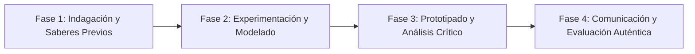

# Planeación Didáctica: Estrategia de Gol: Control Orientado, Pase Filtrado, Paredes y Transiciones Rápidas

> [!INFO] Ficha Técnica y Curricular (NEM 2024 - Fase 6)
> - **Docente Titular:** [[Prof. Israel López Ángeles]] (`usr-teacher-1`)
> - **Nivel y Fase:** Educación Secundaria — [[Fase 6 (1º, 2º y 3º de Secundaria)]]
> - **Grado:** **3º de Secundaria**
> - **Campo Formativo:** [[De lo Humano y lo Comunitario]]
> - **Disciplina / Materia:** [[Educación Física]]
> - **Contenido Sintético Oficial SEP 2024:** *Iniciación al Fútbol y Balonmano: control orientado, pase filtrado y repliegue defensivo*
> - **MOC General:** [[00_Indice_Maestro_Secundaria_Fase6_NEM2024]]

---

## 🎯 Proceso de Desarrollo de Aprendizaje (PDA Oficial SEP 2024)
```text
Fase 6 (3º Secundaria) - Perfecciona el control orientado, conducción con cambio de dirección, pases en profundidad y transiciones ataque-defensa en fútbol reducido y balonmano escolar mixto.
```

---

## ❓ Preguntas Detonadoras e Indagación Crítica
- **¿Cómo un buen control orientado con el empeine o la parte interna permite ganar un segundo crucial para rematar o pasar?**
- **¿Cómo cerramos los espacios en defensa mediante el repliegue y la basculación en bloque?**

---

## 📋 Secuencia Didáctica Detallada (10 Sesiones de 50 Minutos)



### 🚀 Sesiones 1 y 2: Indagación, Diagnóstico y Recuperación de Saberes
- **Inicio (15 min):** Rondo o "Torito" de 4 atacantes contra 1 defensor a 2 toques máximos.
- **Desarrollo (30 min):** Planteamiento del reto integrador, conformación de equipos colaborativos y delimitación del alcance del proyecto.
- **Cierre (5 min):** Registro en la bitácora individual de metas de aprendizaje.

### 🔬 Sesiones 3 a 7: Desarrollo Metodológico, Trabajo Experimental y Producción
- **Inicio (10 min):** Reactivación de compromisos y revisión del cronograma de trabajo.
- **Desarrollo (35 min):** Circuito Táctico de Fútbol/Balonmano Mixto: Ejercicios de paredes $2 \times 1$, triangulaciones rápidas y remates a portería con oposición de portero, culminando en un partido modificado $5 \times 5$ mixto.
- **Cierre (5 min):** Coevaluación intermedia mediante lista de cotejo y retroalimentación entre pares.

### 🏁 Sesiones 8 a 10: Integración, Socialización Comunitaria y Evaluación
- **Inicio (10 min):** Ensayos de presentación y ajuste final de entregables.
- **Desarrollo (30 min):** Análisis táctico en el círculo central y estiramientos musculares de piernas.
- **Cierre (10 min):** Metacognición grupal, balance de impacto social y firma del acta de entrega de proyectos.

---

## 📊 Rúbrica Analítica de Evaluación Formativa y Auténtica

| Nivel de Desempeño | Criterios Curriculares y Evidencias Observables | Ponderación |
| :--- | :--- | :---: |
| **Excelente (10)** | Precisión y velocidad en el control orientado y pase al espacio libre con fundamentación teórica sólida, rigurosa y aplicación práctica contextualizada. | 40% |
| **Satisfactorio (8-9)** | Coordinación táctica en transiciones de ataque y repliegue defensivo de manera autónoma, estructurada y con calidad metodológica. | 35% |
| **En Proceso (6-7)** | Juego limpio, respeto a los rivales y fomento del fútbol mixto con apoyo docente y áreas de mejora identificadas. | 25% |

---

## 📦 Materiales, Recursos Didácticos y Entregable Final

- **Materiales y Recursos:** Balones de fútbol y balonmano, porterías pequeñas, petos, silbatos.
- **Entregable Principal:** `Pizarra de Jugadas Tácticas de Fútbol/Balonmano y Evaluación Formativa de Desempeño.`
- **Instrumentos de Evaluación:** Rúbrica analítica, bitácora de coevaluación entre pares, lista de verificación de entregables.

---

## 🔗 Enlaces Bidireccionales (Obsidian Knowledge Graph)
- [[00_Indice_Maestro_Secundaria_Fase6_NEM2024]]
- [[De lo Humano y lo Comunitario]]
- [[Educación Física]]
- [[Secundaria_3er_Grado]]
- [[Prof_Israel_Lopez_Angeles]]
