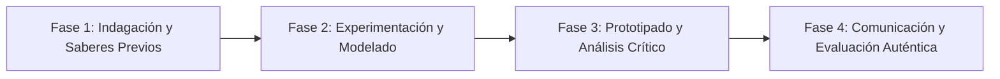

# Planeación Didáctica: Crónicas del Siglo XXI: Reportajes de Fondo y Memoria Comunitaria

> [!INFO] Ficha Técnica y Curricular (NEM 2024 - Fase 6)
> - **Docente Titular:** [[Prof. Israel López Ángeles]] (`usr-teacher-1`)
> - **Nivel y Fase:** Educación Secundaria — [[Fase 6 (1º, 2º y 3º de Secundaria)]]
> - **Grado:** **3º de Secundaria**
> - **Campo Formativo:** [[Lenguajes]]
> - **Disciplina / Materia:** [[Español]]
> - **Contenido Sintético Oficial SEP 2024:** *Los géneros periodísticos de interpretación para preservar la memoria colectiva*
> - **MOC General:** [[00_Indice_Maestro_Secundaria_Fase6_NEM2024]]

---

## 🎯 Proceso de Desarrollo de Aprendizaje (PDA Oficial SEP 2024)
```text
Fase 6 (3º Secundaria) - Analiza los sucesos más significativos de la comunidad y los comunica empleando las características de los géneros periodísticos de interpretación (crónica y reportaje), para preservar la memoria colectiva.
```

---

## ❓ Preguntas Detonadoras e Indagación Crítica
- **¿Cuál es la diferencia entre una noticia inmediata, un artículo de opinión y un reportaje de investigación a fondo?**
- **¿Cómo se construye una crónica combinando datos rigurosos con recursos literarios descriptivos?**
- **¿Qué acontecimiento de nuestra colonia merece una investigación periodística exhaustiva?**
- **¿Por qué el periodismo de calidad es un pilar indispensable de la democracia?**

---

## 📋 Secuencia Didáctica Detallada (10 Sesiones de 50 Minutos)



### 🚀 Sesiones 1 y 2: Indagación, Diagnóstico y Recuperación de Saberes
- **Inicio (15 min):** Lectura de fragmentos de grandes crónicas periodísticas de Carlos Monsiváis y Elena Poniatowska.
- **Desarrollo (30 min):** Planteamiento del reto integrador, conformación de equipos colaborativos y delimitación del alcance del proyecto.
- **Cierre (5 min):** Registro en la bitácora individual de metas de aprendizaje.

### 🔬 Sesiones 3 a 7: Desarrollo Metodológico, Trabajo Experimental y Producción
- **Inicio (10 min):** Reactivación de compromisos y revisión del cronograma de trabajo.
- **Desarrollo (35 min):** Taller de Periodismo de Investigación: En equipos de 3, seleccionar un tema comunitario (mercados tradicionales, historias de superación, impacto ambiental), realizar entrevistas, contrastar fuentes y redactar un reportaje de fondo.
- **Cierre (5 min):** Coevaluación intermedia mediante lista de cotejo y retroalimentación entre pares.

### 🏁 Sesiones 8 a 10: Integración, Socialización Comunitaria y Evaluación
- **Inicio (10 min):** Ensayos de presentación y ajuste final de entregables.
- **Desarrollo (30 min):** Edición y publicación de la Revista Periodística Digital de 3º de Secundaria.
- **Cierre (10 min):** Metacognición grupal, balance de impacto social y firma del acta de entrega de proyectos.

---

## 📊 Rúbrica Analítica de Evaluación Formativa y Auténtica

| Nivel de Desempeño | Criterios Curriculares y Evidencias Observables | Ponderación |
| :--- | :--- | :---: |
| **Excelente (10)** | Rigor en la investigación documental y testimonial de campo con fundamentación teórica sólida, rigurosa y aplicación práctica contextualizada. | 40% |
| **Satisfactorio (8-9)** | Estructura formal de la crónica o reportaje con entrada, cuerpo y remate de manera autónoma, estructurada y con calidad metodológica. | 35% |
| **En Proceso (6-7)** | Ética periodística, contrastación de datos y calidad de redacción con apoyo docente y áreas de mejora identificadas. | 25% |

---

## 📦 Materiales, Recursos Didácticos y Entregable Final

- **Materiales y Recursos:** Periódicos y revistas de fondo, formatos de entrevista, computadoras o pliegos.
- **Entregable Principal:** `Reportaje de Fondo Ilustrado "Crónicas de Nuestra Comunidad: Historia, Retos y Futuro".`
- **Instrumentos de Evaluación:** Rúbrica analítica, bitácora de coevaluación entre pares, lista de verificación de entregables.

---

## 🔗 Enlaces Bidireccionales (Obsidian Knowledge Graph)
- [[00_Indice_Maestro_Secundaria_Fase6_NEM2024]]
- [[Lenguajes]]
- [[Español]]
- [[Secundaria_3er_Grado]]
- [[Prof_Israel_Lopez_Angeles]]
