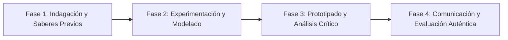

# Planeación Didáctica: Cuentas Claras: El Derecho de Acceso a la Información Pública y la Lucha Anticorrupción

> [!INFO] Ficha Técnica y Curricular (NEM 2024 - Fase 6)
> - **Docente Titular:** [[Prof. Israel López Ángeles]] (`usr-teacher-1`)
> - **Nivel y Fase:** Educación Secundaria — [[Fase 6 (1º, 2º y 3º de Secundaria)]]
> - **Grado:** **3º de Secundaria**
> - **Campo Formativo:** [[Ética, Naturaleza y Sociedades]]
> - **Disciplina / Materia:** [[Formación Cívica y Ética]]
> - **Contenido Sintético Oficial SEP 2024:** *Transparencia, rendición de cuentas y acceso a la información pública (INAI)*
> - **MOC General:** [[00_Indice_Maestro_Secundaria_Fase6_NEM2024]]

---

## 🎯 Proceso de Desarrollo de Aprendizaje (PDA Oficial SEP 2024)
```text
Fase 6 (3º Secundaria) - Analiza y ejerce el derecho al acceso a la información pública, la protección de datos personales y la rendición de cuentas de servidores públicos a través de la Plataforma Nacional de Transparencia.
```

---

## ❓ Preguntas Detonadoras e Indagación Crítica
- **¿Por qué el dinero público proviene de los impuestos de todos y los gobernantes tienen la obligación legal de rendir cuentas peso por peso?**
- **¿Cómo protege el INAI nuestros datos personales (huellas, fotos, historiales clínicos) frente al espionaje y la delincuencia digital?**
- **¿Cómo realizamos una solicitud ciudadana de acceso a la información pública?**

---

## 📋 Secuencia Didáctica Detallada (10 Sesiones de 50 Minutos)



### 🚀 Sesiones 1 y 2: Indagación, Diagnóstico y Recuperación de Saberes
- **Inicio (15 min):** Inspección de la Plataforma Nacional de Transparencia de México (PNT).
- **Desarrollo (30 min):** Planteamiento del reto integrador, conformación de equipos colaborativos y delimitación del alcance del proyecto.
- **Cierre (5 min):** Registro en la bitácora individual de metas de aprendizaje.

### 🔬 Sesiones 3 a 7: Desarrollo Metodológico, Trabajo Experimental y Producción
- **Inicio (10 min):** Reactivación de compromisos y revisión del cronograma de trabajo.
- **Desarrollo (35 min):** Taller de Solicitud de Información Pública Simulada: En equipos, redactar una solicitud formal de presupuesto sobre el mantenimiento de parques públicos o escuelas locales, evaluando tiempos de respuesta legal y recursos de revisión.
- **Cierre (5 min):** Coevaluación intermedia mediante lista de cotejo y retroalimentación entre pares.

### 🏁 Sesiones 8 a 10: Integración, Socialización Comunitaria y Evaluación
- **Inicio (10 min):** Ensayos de presentación y ajuste final de entregables.
- **Desarrollo (30 min):** Decálogo para la protección de la privacidad digital y contraseñas seguras.
- **Cierre (10 min):** Metacognición grupal, balance de impacto social y firma del acta de entrega de proyectos.

---

## 📊 Rúbrica Analítica de Evaluación Formativa y Auténtica

| Nivel de Desempeño | Criterios Curriculares y Evidencias Observables | Ponderación |
| :--- | :--- | :---: |
| **Excelente (10)** | Comprensión del marco legal del Artículo 6º Constitucional y la Ley de Transparencia con fundamentación teórica sólida, rigurosa y aplicación práctica contextualizada. | 40% |
| **Satisfactorio (8-9)** | Elaboración técnica de una solicitud formal de información pública de manera autónoma, estructurada y con calidad metodológica. | 35% |
| **En Proceso (6-7)** | Conciencia crítica sobre la protección de la identidad y datos personales con apoyo docente y áreas de mejora identificadas. | 25% |

---

## 📦 Materiales, Recursos Didácticos y Entregable Final

- **Materiales y Recursos:** Formatos de solicitud de la PNT, guías del INAI sobre privacidad de datos.
- **Entregable Principal:** `Expediente de Solicitud de Transparencia Simulada y Guía de Protección de Datos Personales.`
- **Instrumentos de Evaluación:** Rúbrica analítica, bitácora de coevaluación entre pares, lista de verificación de entregables.

---

## 🔗 Enlaces Bidireccionales (Obsidian Knowledge Graph)
- [[00_Indice_Maestro_Secundaria_Fase6_NEM2024]]
- [[Ética, Naturaleza y Sociedades]]
- [[Formación Cívica y Ética]]
- [[Secundaria_3er_Grado]]
- [[Prof_Israel_Lopez_Angeles]]
