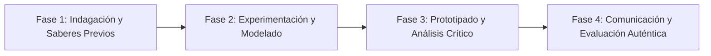

# Planeación Didáctica: Cero Brechas: Igualdad Sustantiva, No Discriminación y Derechos Plenos de las Mujeres

> [!INFO] Ficha Técnica y Curricular (NEM 2024 - Fase 6)
> - **Docente Titular:** [[Prof. Israel López Ángeles]] (`usr-teacher-1`)
> - **Nivel y Fase:** Educación Secundaria — [[Fase 6 (1º, 2º y 3º de Secundaria)]]
> - **Grado:** **3º de Secundaria**
> - **Campo Formativo:** [[Ética, Naturaleza y Sociedades]]
> - **Disciplina / Materia:** [[Formación Cívica y Ética]]
> - **Contenido Sintético Oficial SEP 2024:** *Igualdad sustantiva y perspectiva de género para erradicar el machismo*
> - **MOC General:** [[00_Indice_Maestro_Secundaria_Fase6_NEM2024]]

---

## 🎯 Proceso de Desarrollo de Aprendizaje (PDA Oficial SEP 2024)
```text
Fase 6 (3º Secundaria) - Participa en acciones dirigidas a reducir brechas de desigualdad de género en la escuela y comunidad, analizando leyes de paridad, brecha salarial y rechazando todo tipo de discriminación sexista.
```

---

## ❓ Preguntas Detonadoras e Indagación Crítica
- **¿Por qué la IGUALDAD SUSTANTIVA exige no solo leyes en papel sino cambios reales en la vida diaria?**
- **¿Qué factores perpetúan la brecha salarial y la sobrecarga no remunerada de trabajo doméstico en las mujeres?**
- **¿Cómo construimos masculinidades positivas basadas en el cuidado, la empatía y la no violencia?**

---

## 📋 Secuencia Didáctica Detallada (10 Sesiones de 50 Minutos)



### 🚀 Sesiones 1 y 2: Indagación, Diagnóstico y Recuperación de Saberes
- **Inicio (15 min):** Análisis de estadísticas del INEGI sobre el uso del tiempo libre y salarios por género.
- **Desarrollo (30 min):** Planteamiento del reto integrador, conformación de equipos colaborativos y delimitación del alcance del proyecto.
- **Cierre (5 min):** Registro en la bitácora individual de metas de aprendizaje.

### 🔬 Sesiones 3 a 7: Desarrollo Metodológico, Trabajo Experimental y Producción
- **Inicio (10 min):** Reactivación de compromisos y revisión del cronograma de trabajo.
- **Desarrollo (35 min):** Taller de Auditoría de Género Escolar: Revisar el uso de espacios deportivos en el recreo, liderazgos en comisiones escolares y libros de texto, redactando un Plan de Acción de Paridad e Inclusión.
- **Cierre (5 min):** Coevaluación intermedia mediante lista de cotejo y retroalimentación entre pares.

### 🏁 Sesiones 8 a 10: Integración, Socialización Comunitaria y Evaluación
- **Inicio (10 min):** Ensayos de presentación y ajuste final de entregables.
- **Desarrollo (30 min):** Presentación del Plan de Igualdad Sustantiva a la Dirección de la Secundaria.
- **Cierre (10 min):** Metacognición grupal, balance de impacto social y firma del acta de entrega de proyectos.

---

## 📊 Rúbrica Analítica de Evaluación Formativa y Auténtica

| Nivel de Desempeño | Criterios Curriculares y Evidencias Observables | Ponderación |
| :--- | :--- | :---: |
| **Excelente (10)** | Manejo de conceptos de género, paridad, roles estereotipados e igualdad sustantiva con fundamentación teórica sólida, rigurosa y aplicación práctica contextualizada. | 40% |
| **Satisfactorio (8-9)** | Diagnóstico riguroso con datos estadísticos de la realidad escolar de manera autónoma, estructurada y con calidad metodológica. | 35% |
| **En Proceso (6-7)** | Diseño de propuestas concretas y transformadoras para erradicar el sexismo con apoyo docente y áreas de mejora identificadas. | 25% |

---

## 📦 Materiales, Recursos Didácticos y Entregable Final

- **Materiales y Recursos:** Estadísticas del INEGI/INMUJERES, cartulinas, formatos de auditoría escolar.
- **Entregable Principal:** `Diagnóstico Escolar de Equidad de Género y Plan de Acción de Igualdad Sustantiva.`
- **Instrumentos de Evaluación:** Rúbrica analítica, bitácora de coevaluación entre pares, lista de verificación de entregables.

---

## 🔗 Enlaces Bidireccionales (Obsidian Knowledge Graph)
- [[00_Indice_Maestro_Secundaria_Fase6_NEM2024]]
- [[Ética, Naturaleza y Sociedades]]
- [[Formación Cívica y Ética]]
- [[Secundaria_3er_Grado]]
- [[Prof_Israel_Lopez_Angeles]]
