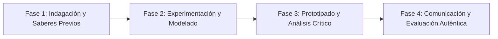

# Planeación Didáctica: Nunca Más: Fascismo, Resistencia, la Segunda Guerra Mundial (1939-1945) y el Holocausto

> [!INFO] Ficha Técnica y Curricular (NEM 2024 - Fase 6)
> - **Docente Titular:** [[Prof. Israel López Ángeles]] (`usr-teacher-1`)
> - **Nivel y Fase:** Educación Secundaria — [[Fase 6 (1º, 2º y 3º de Secundaria)]]
> - **Grado:** **3º de Secundaria**
> - **Campo Formativo:** [[Ética, Naturaleza y Sociedades]]
> - **Disciplina / Materia:** [[Historia]]
> - **Contenido Sintético Oficial SEP 2024:** *La Segunda Guerra Mundial, el Holocausto y la bomba atómica*
> - **MOC General:** [[00_Indice_Maestro_Secundaria_Fase6_NEM2024]]

---

## 🎯 Proceso de Desarrollo de Aprendizaje (PDA Oficial SEP 2024)
```text
Fase 6 (3º Secundaria) - Problematiza el surgimiento del fascismo y nazismo, elabora un organizador cronológico de la Segunda Guerra Mundial, reflexiona sobre el Holocausto y debate el lanzamiento de las bombas atómicas en Hiroshima y Nagasaki.
```

---

## ❓ Preguntas Detonadoras e Indagación Crítica
- **¿Cómo el totalitarismo y la propaganda de odio nazi condujeron al genocidio sistemático de 6 millones de judíos y minorías?**
- **¿Qué papel jugó la Batalla de Stalingrado y el Día D en la derrota del Eje?**
- **¿Por qué el uso de armas nucleares en 1945 cambió para siempre la historia militar y ética de la humanidad?**

---

## 📋 Secuencia Didáctica Detallada (10 Sesiones de 50 Minutos)



### 🚀 Sesiones 1 y 2: Indagación, Diagnóstico y Recuperación de Saberes
- **Inicio (15 min):** Lectura de fragmentos del Diario de Ana Frank y testimonios de supervivientes de Auschwitz.
- **Desarrollo (30 min):** Planteamiento del reto integrador, conformación de equipos colaborativos y delimitación del alcance del proyecto.
- **Cierre (5 min):** Registro en la bitácora individual de metas de aprendizaje.

### 🔬 Sesiones 3 a 7: Desarrollo Metodológico, Trabajo Experimental y Producción
- **Inicio (10 min):** Reactivación de compromisos y revisión del cronograma de trabajo.
- **Desarrollo (35 min):** Taller de Memoria y Derechos Humanos: Elaborar un mapa cronológico interactivo de las etapas de la guerra y redactar un ensayo ético sobre la Declaración Universal de los Derechos Humanos nacida en 1948 para evitar que la barbarie se repita.
- **Cierre (5 min):** Coevaluación intermedia mediante lista de cotejo y retroalimentación entre pares.

### 🏁 Sesiones 8 a 10: Integración, Socialización Comunitaria y Evaluación
- **Inicio (10 min):** Ensayos de presentación y ajuste final de entregables.
- **Desarrollo (30 min):** Encendido simbólico de velas por las víctimas de la guerra y la intolerancia.
- **Cierre (10 min):** Metacognición grupal, balance de impacto social y firma del acta de entrega de proyectos.

---

## 📊 Rúbrica Analítica de Evaluación Formativa y Auténtica

| Nivel de Desempeño | Criterios Curriculares y Evidencias Observables | Ponderación |
| :--- | :--- | :---: |
| **Excelente (10)** | Comprensión de las causas ideológicas, económicas y militares del conflicto con fundamentación teórica sólida, rigurosa y aplicación práctica contextualizada. | 40% |
| **Satisfactorio (8-9)** | Condena inequívoca del racismo, fascismo y crímenes de lesa humanidad de manera autónoma, estructurada y con calidad metodológica. | 35% |
| **En Proceso (6-7)** | Reflexión sobre el desarme nuclear y la cultura de paz internacional con apoyo docente y áreas de mejora identificadas. | 25% |

---

## 📦 Materiales, Recursos Didácticos y Entregable Final

- **Materiales y Recursos:** Testimonios de supervivientes, mapas bélicos de 1939-1945, líneas de tiempo.
- **Entregable Principal:** `Memoria Histórica Ilustrada "El Imperativo del Nunca Más: Lecciones de 1939-1945".`
- **Instrumentos de Evaluación:** Rúbrica analítica, bitácora de coevaluación entre pares, lista de verificación de entregables.

---

## 🔗 Enlaces Bidireccionales (Obsidian Knowledge Graph)
- [[00_Indice_Maestro_Secundaria_Fase6_NEM2024]]
- [[Ética, Naturaleza y Sociedades]]
- [[Historia]]
- [[Secundaria_3er_Grado]]
- [[Prof_Israel_Lopez_Angeles]]
