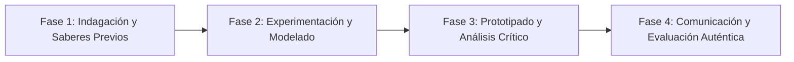

# Planeación Didáctica: Vientos de Libertad: Descolonización Africana, Gandhi y la Conferencia de Bandung

> [!INFO] Ficha Técnica y Curricular (NEM 2024 - Fase 6)
> - **Docente Titular:** [[Prof. Israel López Ángeles]] (`usr-teacher-1`)
> - **Nivel y Fase:** Educación Secundaria — [[Fase 6 (1º, 2º y 3º de Secundaria)]]
> - **Grado:** **3º de Secundaria**
> - **Campo Formativo:** [[Ética, Naturaleza y Sociedades]]
> - **Disciplina / Materia:** [[Historia]]
> - **Contenido Sintético Oficial SEP 2024:** *La descolonización de Asia y África y el movimiento de países no alineados*
> - **MOC General:** [[00_Indice_Maestro_Secundaria_Fase6_NEM2024]]

---

## 🎯 Proceso de Desarrollo de Aprendizaje (PDA Oficial SEP 2024)
```text
Fase 6 (3º Secundaria) - Indaga acerca de los procesos de descolonización en Asia (la resistencia no violenta de Mahatma Gandhi en la India) y África (Argelia, Ghana, Congo), y el Movimiento de Países No Alineados.
```

---

## ❓ Preguntas Detonadoras e Indagación Crítica
- **¿Cómo la filosofía de la "Ahimsa" (no violencia activa) y la Marcha de la Sal de Gandhi derrotaron al Imperio Británico?**
- **¿Qué heridas territoriales y guerras civiles dejó el reparto colonial artificial de África?**

---

## 📋 Secuencia Didáctica Detallada (10 Sesiones de 50 Minutos)



### 🚀 Sesiones 1 y 2: Indagación, Diagnóstico y Recuperación de Saberes
- **Inicio (15 min):** Lectura de fragmentos de los escritos de Frantz Fanon (Los Condenados de la Tierra) y Gandhi.
- **Desarrollo (30 min):** Planteamiento del reto integrador, conformación de equipos colaborativos y delimitación del alcance del proyecto.
- **Cierre (5 min):** Registro en la bitácora individual de metas de aprendizaje.

### 🔬 Sesiones 3 a 7: Desarrollo Metodológico, Trabajo Experimental y Producción
- **Inicio (10 min):** Reactivación de compromisos y revisión del cronograma de trabajo.
- **Desarrollo (35 min):** Taller de Historia Global: Comparar las vías de independencia pacífica (India) vs lucha armada (Argelia) y mapear los 10 principios de Bandung de autodeterminación y soberanía.
- **Cierre (5 min):** Coevaluación intermedia mediante lista de cotejo y retroalimentación entre pares.

### 🏁 Sesiones 8 a 10: Integración, Socialización Comunitaria y Evaluación
- **Inicio (10 min):** Ensayos de presentación y ajuste final de entregables.
- **Desarrollo (30 min):** Reflexión sobre el neocolonialismo económico en el siglo XXI.
- **Cierre (10 min):** Metacognición grupal, balance de impacto social y firma del acta de entrega de proyectos.

---

## 📊 Rúbrica Analítica de Evaluación Formativa y Auténtica

| Nivel de Desempeño | Criterios Curriculares y Evidencias Observables | Ponderación |
| :--- | :--- | :---: |
| **Excelente (10)** | Comprensión de las causas del fin de los imperios coloniales europeos con fundamentación teórica sólida, rigurosa y aplicación práctica contextualizada. | 40% |
| **Satisfactorio (8-9)** | Análisis de la resistencia no violenta como estrategia política de manera autónoma, estructurada y con calidad metodológica. | 35% |
| **En Proceso (6-7)** | Mapeo del surgimiento de nuevas naciones en Asia y África con apoyo docente y áreas de mejora identificadas. | 25% |

---

## 📦 Materiales, Recursos Didácticos y Entregable Final

- **Materiales y Recursos:** Mapas históricos de África y Asia (1945-1970), discursos de Gandhi y Lumumba.
- **Entregable Principal:** `Atlas Histórico de la Descolonización y Ensayo "Gandhi y el Poder de la No Violencia".`
- **Instrumentos de Evaluación:** Rúbrica analítica, bitácora de coevaluación entre pares, lista de verificación de entregables.

---

## 🔗 Enlaces Bidireccionales (Obsidian Knowledge Graph)
- [[00_Indice_Maestro_Secundaria_Fase6_NEM2024]]
- [[Ética, Naturaleza y Sociedades]]
- [[Historia]]
- [[Secundaria_3er_Grado]]
- [[Prof_Israel_Lopez_Angeles]]
