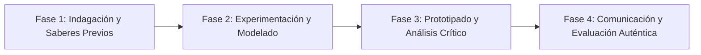

# Planeación Didáctica: Eco-Heroes: Community Campaigns and Problem-Solving Proposals in English

> [!INFO] Ficha Técnica y Curricular (NEM 2024 - Fase 6)
> - **Docente Titular:** [[Prof. Israel López Ángeles]] (`usr-teacher-1`)
> - **Nivel y Fase:** Educación Secundaria — [[Fase 6 (1º, 2º y 3º de Secundaria)]]
> - **Grado:** **3º de Secundaria**
> - **Campo Formativo:** [[Lenguajes]]
> - **Disciplina / Materia:** [[Inglés]]
> - **Contenido Sintético Oficial SEP 2024:** *El uso del inglés para expresar necesidades y problemas de la comunidad*
> - **MOC General:** [[00_Indice_Maestro_Secundaria_Fase6_NEM2024]]

---

## 🎯 Proceso de Desarrollo de Aprendizaje (PDA Oficial SEP 2024)
```text
Fase 6 (3º Secundaria) - Organiza una campaña en inglés sobre soluciones a problemas de la comunidad (ahorro de agua, reciclaje, reforestación), diseñando carteles, discursos persuasivos y folletos informativos.
```

---

## ❓ Preguntas Detonadoras e Indagación Crítica
- **How can we express urgency and call for environmental action using modals in English (must, should, have to)?**
- **What local problems can we address in an international social media campaign in English?**
- **How do we write a persuasive slogan and an action plan with sequence connectors (First, Next, Finally)?**
- **Why is global environmental awareness a responsibility of our generation?**

---

## 📋 Secuencia Didáctica Detallada (10 Sesiones de 50 Minutos)



### 🚀 Sesiones 1 y 2: Indagación, Diagnóstico y Recuperación de Saberes
- **Inicio (15 min):** Analysis of famous international youth environmental speeches (e.g. youth climate summits).
- **Desarrollo (30 min):** Planteamiento del reto integrador, conformación de equipos colaborativos y delimitación del alcance del proyecto.
- **Cierre (5 min):** Registro en la bitácora individual de metas de aprendizaje.

### 🔬 Sesiones 3 a 7: Desarrollo Metodológico, Trabajo Experimental y Producción
- **Inicio (10 min):** Reactivación de compromisos y revisión del cronograma de trabajo.
- **Desarrollo (35 min):** Campaign Production Workshop: In teams of 4, design an environmental campaign with a digital poster, a 30-second persuasive speech in English, and a leaflet with 5 concrete action steps using modal verbs.
- **Cierre (5 min):** Coevaluación intermedia mediante lista de cotejo y retroalimentación entre pares.

### 🏁 Sesiones 8 a 10: Integración, Socialización Comunitaria y Evaluación
- **Inicio (10 min):** Ensayos de presentación y ajuste final de entregables.
- **Desarrollo (30 min):** Pitch Presentation: Each team presents their campaign in English to the class.
- **Cierre (10 min):** Metacognición grupal, balance de impacto social y firma del acta de entrega de proyectos.

---

## 📊 Rúbrica Analítica de Evaluación Formativa y Auténtica

| Nivel de Desempeño | Criterios Curriculares y Evidencias Observables | Ponderación |
| :--- | :--- | :---: |
| **Excelente (10)** | Effective use of modal verbs (should, must, can) and imperative sentences con fundamentación teórica sólida, rigurosa y aplicación práctica contextualizada. | 40% |
| **Satisfactorio (8-9)** | Persuasive rhetoric, fluency, and pronunciation in the spoken presentation de manera autónoma, estructurada y con calidad metodológica. | 35% |
| **En Proceso (6-7)** | Relevance, creativity, and visual impact of campaign materials con apoyo docente y áreas de mejora identificadas. | 25% |

---

## 📦 Materiales, Recursos Didácticos y Entregable Final

- **Materiales y Recursos:** Poster boards, markers, audio recording device for oral pitch.
- **Entregable Principal:** `Campaign Kit "Save Our Community: Green Actions for Global Impact" (Poster & Speech Script).`
- **Instrumentos de Evaluación:** Rúbrica analítica, bitácora de coevaluación entre pares, lista de verificación de entregables.

---

## 🔗 Enlaces Bidireccionales (Obsidian Knowledge Graph)
- [[00_Indice_Maestro_Secundaria_Fase6_NEM2024]]
- [[Lenguajes]]
- [[Inglés]]
- [[Secundaria_3er_Grado]]
- [[Prof_Israel_Lopez_Angeles]]
