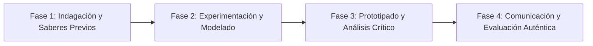

# Planeación Didáctica: La Huella de Samos: Demostraciones Geométricas del Teorema de Pitágoras y Razones Trigonométricas

> [!INFO] Ficha Técnica y Curricular (NEM 2024 - Fase 6)
> - **Docente Titular:** [[Prof. Israel López Ángeles]] (`usr-teacher-1`)
> - **Nivel y Fase:** Educación Secundaria — [[Fase 6 (1º, 2º y 3º de Secundaria)]]
> - **Grado:** **3º de Secundaria**
> - **Campo Formativo:** [[Saberes y Pensamiento Científico]]
> - **Disciplina / Materia:** [[Matemáticas]]
> - **Contenido Sintético Oficial SEP 2024:** *El Teorema de Pitágoras y sus aplicaciones trigonométricas*
> - **MOC General:** [[00_Indice_Maestro_Secundaria_Fase6_NEM2024]]

---

## 🎯 Proceso de Desarrollo de Aprendizaje (PDA Oficial SEP 2024)
```text
Fase 6 (3º Secundaria) - Formula, justifica y usa el teorema de Pitágoras ($a^2 + b^2 = c^2$) y las razones trigonométricas directas (seno, coseno, tangente) al resolver problemas de medición indirecta.
```

---

## ❓ Preguntas Detonadoras e Indagación Crítica
- **¿Cómo calculaban los agrimensores egipcios ángulos rectos perfectos con una cuerda de 12 nudos (terna 3-4-5)?**
- **¿Cómo medimos la altura de un árbol o poste sin subirnos a él usando la sombra y la tangente del ángulo?**
- **¿Por qué el Teorema de Pitágoras solo es válido en triángulos rectángulos?**

---

## 📋 Secuencia Didáctica Detallada (10 Sesiones de 50 Minutos)



### 🚀 Sesiones 1 y 2: Indagación, Diagnóstico y Recuperación de Saberes
- **Inicio (15 min):** Demostración visual con agua y cuadrados de acrílico del Teorema de Pitágoras.
- **Desarrollo (30 min):** Planteamiento del reto integrador, conformación de equipos colaborativos y delimitación del alcance del proyecto.
- **Cierre (5 min):** Registro en la bitácora individual de metas de aprendizaje.

### 🔬 Sesiones 3 a 7: Desarrollo Metodológico, Trabajo Experimental y Producción
- **Inicio (10 min):** Reactivación de compromisos y revisión del cronograma de trabajo.
- **Desarrollo (35 min):** Laboratorio de Medición Indirecta: Construir un goniómetro escolar (inclinómetro), medir ángulos de elevación hacia edificios escolares y calcular alturas usando $\tan(\theta)$ y el Teorema de Pitágoras.
- **Cierre (5 min):** Coevaluación intermedia mediante lista de cotejo y retroalimentación entre pares.

### 🏁 Sesiones 8 a 10: Integración, Socialización Comunitaria y Evaluación
- **Inicio (10 min):** Ensayos de presentación y ajuste final de entregables.
- **Desarrollo (30 min):** Presentación de mediciones topográficas escolares y análisis de margen de error.
- **Cierre (10 min):** Metacognición grupal, balance de impacto social y firma del acta de entrega de proyectos.

---

## 📊 Rúbrica Analítica de Evaluación Formativa y Auténtica

| Nivel de Desempeño | Criterios Curriculares y Evidencias Observables | Ponderación |
| :--- | :--- | :---: |
| **Excelente (10)** | Demostración geométrica y algebraica del Teorema de Pitágoras con fundamentación teórica sólida, rigurosa y aplicación práctica contextualizada. | 40% |
| **Satisfactorio (8-9)** | Cálculo preciso de catetos e hipotenusa en contextos reales de manera autónoma, estructurada y con calidad metodológica. | 35% |
| **En Proceso (6-7)** | Aplicación de razones trigonométricas directas en medición indirecta con apoyo docente y áreas de mejora identificadas. | 25% |

---

## 📦 Materiales, Recursos Didácticos y Entregable Final

- **Materiales y Recursos:** Transportadores, popotes, plomadas (hilo y tuerca), cinta métrica, tablas trigonométricas.
- **Entregable Principal:** `Reporte Topográfico Escolar con Goniómetro y Aplicación de Pitágoras y Trigonometría.`
- **Instrumentos de Evaluación:** Rúbrica analítica, bitácora de coevaluación entre pares, lista de verificación de entregables.

---

## 🔗 Enlaces Bidireccionales (Obsidian Knowledge Graph)
- [[00_Indice_Maestro_Secundaria_Fase6_NEM2024]]
- [[Saberes y Pensamiento Científico]]
- [[Matemáticas]]
- [[Secundaria_3er_Grado]]
- [[Prof_Israel_Lopez_Angeles]]
