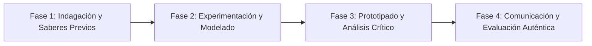

# Planeación Didáctica: Geometría del Espacio: Desarrollos Planos, Sólidos de Revolución y Volúmenes

> [!INFO] Ficha Técnica y Curricular (NEM 2024 - Fase 6)
> - **Docente Titular:** [[Prof. Israel López Ángeles]] (`usr-teacher-1`)
> - **Nivel y Fase:** Educación Secundaria — [[Fase 6 (1º, 2º y 3º de Secundaria)]]
> - **Grado:** **3º de Secundaria**
> - **Campo Formativo:** [[Saberes y Pensamiento Científico]]
> - **Disciplina / Materia:** [[Matemáticas]]
> - **Contenido Sintético Oficial SEP 2024:** *Cálculo de volumen y desarrollos planos de cilindros, conos y esferas*
> - **MOC General:** [[00_Indice_Maestro_Secundaria_Fase6_NEM2024]]

---

## 🎯 Proceso de Desarrollo de Aprendizaje (PDA Oficial SEP 2024)
```text
Fase 6 (3º Secundaria) - Explora y construye desarrollos planos de conos, cilindros y pirámides, calcula sus volúmenes y analiza la relación $V_{\text{cono}} = \frac{1}{3} V_{\text{cilindro}}$ y $V_{\text{esfera}} = \frac{4}{3}\pi r^3$.
```

---

## ❓ Preguntas Detonadoras e Indagación Crítica
- **¿Por qué se necesitan exactamente 3 conos llenos de agua para llenar un cilindro de la misma base y altura?**
- **¿Cómo se genera un sólido de revolución al girar un triángulo o rectángulo en un eje?**

---

## 📋 Secuencia Didáctica Detallada (10 Sesiones de 50 Minutos)



### 🚀 Sesiones 1 y 2: Indagación, Diagnóstico y Recuperación de Saberes
- **Inicio (15 min):** Rotación rápida de figuras planas en un taladro para visualizar sólidos 3D.
- **Desarrollo (30 min):** Planteamiento del reto integrador, conformación de equipos colaborativos y delimitación del alcance del proyecto.
- **Cierre (5 min):** Registro en la bitácora individual de metas de aprendizaje.

### 🔬 Sesiones 3 a 7: Desarrollo Metodológico, Trabajo Experimental y Producción
- **Inicio (10 min):** Reactivación de compromisos y revisión del cronograma de trabajo.
- **Desarrollo (35 min):** Taller de Construcción de Cuerpos Geométricos: Trazar en cartulina el desarrollo plano de conos y cilindros con lengüetas de pegado y calcular su capacidad en mililitros.
- **Cierre (5 min):** Coevaluación intermedia mediante lista de cotejo y retroalimentación entre pares.

### 🏁 Sesiones 8 a 10: Integración, Socialización Comunitaria y Evaluación
- **Inicio (10 min):** Ensayos de presentación y ajuste final de entregables.
- **Desarrollo (30 min):** Comprobación experimental de capacidades con arena o agua coloreada.
- **Cierre (10 min):** Metacognición grupal, balance de impacto social y firma del acta de entrega de proyectos.

---

## 📊 Rúbrica Analítica de Evaluación Formativa y Auténtica

| Nivel de Desempeño | Criterios Curriculares y Evidencias Observables | Ponderación |
| :--- | :--- | :---: |
| **Excelente (10)** | Construcción exacta de desarrollos planos con compás y fórmulas de arco con fundamentación teórica sólida, rigurosa y aplicación práctica contextualizada. | 40% |
| **Satisfactorio (8-9)** | Cálculo algebraico preciso de áreas totales y volúmenes de manera autónoma, estructurada y con calidad metodológica. | 35% |
| **En Proceso (6-7)** | Comprobación de relaciones de volumen entre sólidos con apoyo docente y áreas de mejora identificadas. | 25% |

---

## 📦 Materiales, Recursos Didácticos y Entregable Final

- **Materiales y Recursos:** Cartulina bristol, compás, pegamento, tijeras, probetas graduadas.
- **Entregable Principal:** `Set de Cuerpos Geométricos 3D y Memoria de Cálculo de Capacidad y Volumen.`
- **Instrumentos de Evaluación:** Rúbrica analítica, bitácora de coevaluación entre pares, lista de verificación de entregables.

---

## 🔗 Enlaces Bidireccionales (Obsidian Knowledge Graph)
- [[00_Indice_Maestro_Secundaria_Fase6_NEM2024]]
- [[Saberes y Pensamiento Científico]]
- [[Matemáticas]]
- [[Secundaria_3er_Grado]]
- [[Prof_Israel_Lopez_Angeles]]
