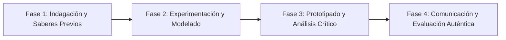

# Planeación Didáctica: Emprendedores Sociales: Plan de Negocios Sustentable, Prototipo Tecnológico y Cooperativismo

> [!INFO] Ficha Técnica y Curricular (NEM 2024 - Fase 6)
> - **Docente Titular:** [[Prof. Israel López Ángeles]] (`usr-teacher-1`)
> - **Nivel y Fase:** Educación Secundaria — [[Fase 6 (1º, 2º y 3º de Secundaria)]]
> - **Grado:** **3º de Secundaria**
> - **Campo Formativo:** [[De lo Humano y lo Comunitario]]
> - **Disciplina / Materia:** [[Tecnología / Tutoría]]
> - **Contenido Sintético Oficial SEP 2024:** *Proyecto integrador comunitario: Emprendimiento tecnológico sustentable*
> - **MOC General:** [[00_Indice_Maestro_Secundaria_Fase6_NEM2024]]

---

## 🎯 Proceso de Desarrollo de Aprendizaje (PDA Oficial SEP 2024)
```text
Fase 6 (3º Secundaria) - Propone e implementa un emprendimiento sustentable o cooperativa escolar para atender una necesidad comunitaria, evaluando costos, impacto social y factibilidad técnica.
```

---

## ❓ Preguntas Detonadoras e Indagación Crítica
- **¿Cómo un emprendimiento social puede generar ingresos justos mientras resuelve un problema ecológico local?**
- **¿Cómo calculamos costos de producción, precio de venta justo y punto de equilibrio en una cooperativa?**
- **¿Qué modelo de economía social y solidaria empodera a los jóvenes de la secundaria?**

---

## 📋 Secuencia Didáctica Detallada (10 Sesiones de 50 Minutos)



### 🚀 Sesiones 1 y 2: Indagación, Diagnóstico y Recuperación de Saberes
- **Inicio (15 min):** Casos de éxito de cooperativas juveniles y empresas sociales en México.
- **Desarrollo (30 min):** Planteamiento del reto integrador, conformación de equipos colaborativos y delimitación del alcance del proyecto.
- **Cierre (5 min):** Registro en la bitácora individual de metas de aprendizaje.

### 🔬 Sesiones 3 a 7: Desarrollo Metodológico, Trabajo Experimental y Producción
- **Inicio (10 min):** Reactivación de compromisos y revisión del cronograma de trabajo.
- **Desarrollo (35 min):** Taller de Emprendimiento Social: Diseñar el Modelo Canvas de un producto ecológico (jabones biodegradables con aceite reciclado, libretas de papel reciclado, huertos verticales), fabricar el prototipo y elaborar el plan financiero.
- **Cierre (5 min):** Coevaluación intermedia mediante lista de cotejo y retroalimentación entre pares.

### 🏁 Sesiones 8 a 10: Integración, Socialización Comunitaria y Evaluación
- **Inicio (10 min):** Ensayos de presentación y ajuste final de entregables.
- **Desarrollo (30 min):** Feria de Emprendimiento Social y presentación del pitch de ventas ante la comunidad.
- **Cierre (10 min):** Metacognición grupal, balance de impacto social y firma del acta de entrega de proyectos.

---

## 📊 Rúbrica Analítica de Evaluación Formativa y Auténtica

| Nivel de Desempeño | Criterios Curriculares y Evidencias Observables | Ponderación |
| :--- | :--- | :---: |
| **Excelente (10)** | Estructuración completa del modelo de negocio sustentable (Canvas) con fundamentación teórica sólida, rigurosa y aplicación práctica contextualizada. | 40% |
| **Satisfactorio (8-9)** | Calidad, funcionalidad e impacto ambiental positivo del prototipo fabricado de manera autónoma, estructurada y con calidad metodológica. | 35% |
| **En Proceso (6-7)** | Habilidades de trabajo en equipo cooperativo, liderazgo ético y comunicación con apoyo docente y áreas de mejora identificadas. | 25% |

---

## 📦 Materiales, Recursos Didácticos y Entregable Final

- **Materiales y Recursos:** Plantillas de Modelo Canvas, insumos para prototipos, calculadoras.
- **Entregable Principal:** `Plan de Negocios del Emprendimiento Social y Prototipo Tecnológico Terminado.`
- **Instrumentos de Evaluación:** Rúbrica analítica, bitácora de coevaluación entre pares, lista de verificación de entregables.

---

## 🔗 Enlaces Bidireccionales (Obsidian Knowledge Graph)
- [[00_Indice_Maestro_Secundaria_Fase6_NEM2024]]
- [[De lo Humano y lo Comunitario]]
- [[Tecnología / Tutoría]]
- [[Secundaria_3er_Grado]]
- [[Prof_Israel_Lopez_Angeles]]
