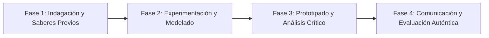

# Planeación Didáctica: Comunidad en Movimiento: Gran Festival Escolar de Ecotecnias, Bienestar y Deporte Comunitario

> [!INFO] Ficha Técnica y Curricular (NEM 2024 - Fase 6)
> - **Docente Titular:** [[Prof. Israel López Ángeles]] (`usr-teacher-1`)
> - **Nivel y Fase:** Educación Secundaria — [[Fase 6 (1º, 2º y 3º de Secundaria)]]
> - **Grado:** **3º de Secundaria**
> - **Campo Formativo:** [[De lo Humano y lo Comunitario]]
> - **Disciplina / Materia:** [[De lo Humano / Interdisciplinaria]]
> - **Contenido Sintético Oficial SEP 2024:** *Festival comunitario escolar de salud, tecnología y deporte*
> - **MOC General:** [[00_Indice_Maestro_Secundaria_Fase6_NEM2024]]

---

## 🎯 Proceso de Desarrollo de Aprendizaje (PDA Oficial SEP 2024)
```text
Fase 6 (3º Secundaria) - Integra todos los aprendizajes del Campo De lo Humano y lo Comunitario para organizar y liderar un Festival Comunitario que combine exhibición de ecotecnias, talleres socioemocionales y circuito deportivo para toda la comunidad.
```

---

## ❓ Preguntas Detonadoras e Indagación Crítica
- **¿Cómo podemos involucrar a padres de familia, vecinos y estudiantes en una gran jornada de fiesta, salud y ciencia comunitaria?**
- **¿Qué impacto transformador deja en nuestra escuela un evento masivo organizado por los propios alumnos?**

---

## 📋 Secuencia Didáctica Detallada (10 Sesiones de 50 Minutos)



### 🚀 Sesiones 1 y 2: Indagación, Diagnóstico y Recuperación de Saberes
- **Inicio (15 min):** Instalación del Comité Coordinador General de Alumnos de 3º Grado con asignación de comisiones.
- **Desarrollo (30 min):** Planteamiento del reto integrador, conformación de equipos colaborativos y delimitación del alcance del proyecto.
- **Cierre (5 min):** Registro en la bitácora individual de metas de aprendizaje.

### 🔬 Sesiones 3 a 7: Desarrollo Metodológico, Trabajo Experimental y Producción
- **Inicio (10 min):** Reactivación de compromisos y revisión del cronograma de trabajo.
- **Desarrollo (35 min):** Operación del Festival Comunitario en 3 Pabellones: Pabellón 1 (Tecnología y Ecotecnias: Muestra de deshidratadores, calentadores solares y robots); Pabellón 2 (Salud y Bienestar: Módulo de toma de presión, menú saludable y buzón emocional); Pabellón 3 (Deportes y Juegos Tradicionales: Torneos relámpago de Ultimate Frisbee y Pelota Purépecha).
- **Cierre (5 min):** Coevaluación intermedia mediante lista de cotejo y retroalimentación entre pares.

### 🏁 Sesiones 8 a 10: Integración, Socialización Comunitaria y Evaluación
- **Inicio (10 min):** Ensayos de presentación y ajuste final de entregables.
- **Desarrollo (30 min):** Ceremonia de clausura comunitaria, entrega de reconocimientos y evaluación de impacto.
- **Cierre (10 min):** Metacognición grupal, balance de impacto social y firma del acta de entrega de proyectos.

---

## 📊 Rúbrica Analítica de Evaluación Formativa y Auténtica

| Nivel de Desempeño | Criterios Curriculares y Evidencias Observables | Ponderación |
| :--- | :--- | :---: |
| **Excelente (10)** | Integración armónica de Tecnología, Tutoría y Educación Física con fundamentación teórica sólida, rigurosa y aplicación práctica contextualizada. | 40% |
| **Satisfactorio (8-9)** | Liderazgo organizativo autónomo, logística impecable y trabajo colaborativo de manera autónoma, estructurada y con calidad metodológica. | 35% |
| **En Proceso (6-7)** | Impacto social positivo y participación activa de las familias en la escuela con apoyo docente y áreas de mejora identificadas. | 25% |

---

## 📦 Materiales, Recursos Didácticos y Entregable Final

- **Materiales y Recursos:** Mesas, carpas, equipos deportivos, prototipos técnicos, lonas informativas.
- **Entregable Principal:** `Memoria Gráfica y Audiovisual del Festival Comunitario Escolar y Balance de Impacto.`
- **Instrumentos de Evaluación:** Rúbrica analítica, bitácora de coevaluación entre pares, lista de verificación de entregables.

---

## 🔗 Enlaces Bidireccionales (Obsidian Knowledge Graph)
- [[00_Indice_Maestro_Secundaria_Fase6_NEM2024]]
- [[De lo Humano y lo Comunitario]]
- [[De lo Humano / Interdisciplinaria]]
- [[Secundaria_3er_Grado]]
- [[Prof_Israel_Lopez_Angeles]]
