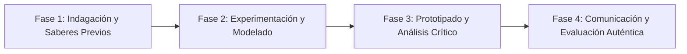

# Planeación Didáctica: La Huella de la Materia: Masa, Volumen, Densidad y Puntos de Fusión/Ebullición

> [!INFO] Ficha Técnica y Curricular (NEM 2024 - Fase 6)
> - **Docente Titular:** [[Prof. Israel López Ángeles]] (`usr-teacher-1`)
> - **Nivel y Fase:** Educación Secundaria — [[Fase 6 (1º, 2º y 3º de Secundaria)]]
> - **Grado:** **3º de Secundaria**
> - **Campo Formativo:** [[Saberes y Pensamiento Científico]]
> - **Disciplina / Materia:** [[Química]]
> - **Contenido Sintético Oficial SEP 2024:** *Propiedades extensivas e intensivas de la materia*
> - **MOC General:** [[00_Indice_Maestro_Secundaria_Fase6_NEM2024]]

---

## 🎯 Proceso de Desarrollo de Aprendizaje (PDA Oficial SEP 2024)
```text
Fase 6 (3º Secundaria) - Formula hipótesis para diferenciar propiedades extensivas (dependen de la cantidad de materia: masa, volumen) e intensivas (características de la sustancia: densidad, solubilidad, punto de ebullición).
```

---

## ❓ Preguntas Detonadoras e Indagación Crítica
- **¿Por qué $1\text{ litro}$ de agua y $100\text{ litros}$ de agua hierven exactamente a la misma temperatura ($100^{\circ}\text{C}$)?**
- **¿Por qué el aceite flota sobre el agua aunque tengamos un galón de aceite y un vaso de agua (densidad $\rho = m/V$)?**
- **¿Cómo nos permiten las propiedades intensivas identificar una sustancia desconocida en criminalística o minería?**

---

## 📋 Secuencia Didáctica Detallada (10 Sesiones de 50 Minutos)



### 🚀 Sesiones 1 y 2: Indagación, Diagnóstico y Recuperación de Saberes
- **Inicio (15 min):** Desafío de las dos botellas idénticas: Una con agua destilada y otra con alcohol.
- **Desarrollo (30 min):** Planteamiento del reto integrador, conformación de equipos colaborativos y delimitación del alcance del proyecto.
- **Cierre (5 min):** Registro en la bitácora individual de metas de aprendizaje.

### 🔬 Sesiones 3 a 7: Desarrollo Metodológico, Trabajo Experimental y Producción
- **Inicio (10 min):** Reactivación de compromisos y revisión del cronograma de trabajo.
- **Desarrollo (35 min):** Laboratorio de Determinación de Densidad: Medir con balanza y probeta la masa y volumen de diferentes metales sólidos y líquidos, graficar $m$ vs $V$ y calcular la pendiente (densidad).
- **Cierre (5 min):** Coevaluación intermedia mediante lista de cotejo y retroalimentación entre pares.

### 🏁 Sesiones 8 a 10: Integración, Socialización Comunitaria y Evaluación
- **Inicio (10 min):** Ensayos de presentación y ajuste final de entregables.
- **Desarrollo (30 min):** Construcción de una columna de 5 densidades con líquidos de colores (miel, jabón, agua, aceite, alcohol).
- **Cierre (10 min):** Metacognición grupal, balance de impacto social y firma del acta de entrega de proyectos.

---

## 📊 Rúbrica Analítica de Evaluación Formativa y Auténtica

| Nivel de Desempeño | Criterios Curriculares y Evidencias Observables | Ponderación |
| :--- | :--- | :---: |
| **Excelente (10)** | Diferenciación conceptual y experimental entre propiedades extensivas e intensivas con fundamentación teórica sólida, rigurosa y aplicación práctica contextualizada. | 40% |
| **Satisfactorio (8-9)** | Uso adecuado de instrumentos de medición (balanza granataria, probeta, termómetro) de manera autónoma, estructurada y con calidad metodológica. | 35% |
| **En Proceso (6-7)** | Cálculo de densidad con unidades del SI ($\text{g/cm}^3$, $\text{kg/m}^3$) con apoyo docente y áreas de mejora identificadas. | 25% |

---

## 📦 Materiales, Recursos Didácticos y Entregable Final

- **Materiales y Recursos:** Balanza granataria, probetas, termómetros, muestras metálicas, líquidos de uso común.
- **Entregable Principal:** `Reporte de Laboratorio "Determinación Experimental de Densidad y Columna de Líquidos".`
- **Instrumentos de Evaluación:** Rúbrica analítica, bitácora de coevaluación entre pares, lista de verificación de entregables.

---

## 🔗 Enlaces Bidireccionales (Obsidian Knowledge Graph)
- [[00_Indice_Maestro_Secundaria_Fase6_NEM2024]]
- [[Saberes y Pensamiento Científico]]
- [[Química]]
- [[Secundaria_3er_Grado]]
- [[Prof_Israel_Lopez_Angeles]]
