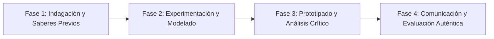

# Planeación Didáctica: La Escala de la Acidez: Indicadores Naturales, pH y Neutralización Química

> [!INFO] Ficha Técnica y Curricular (NEM 2024 - Fase 6)
> - **Docente Titular:** [[Prof. Israel López Ángeles]] (`usr-teacher-1`)
> - **Nivel y Fase:** Educación Secundaria — [[Fase 6 (1º, 2º y 3º de Secundaria)]]
> - **Grado:** **3º de Secundaria**
> - **Campo Formativo:** [[Saberes y Pensamiento Científico]]
> - **Disciplina / Materia:** [[Química]]
> - **Contenido Sintético Oficial SEP 2024:** *Propiedades de ácidos y bases, escala de pH y reacciones de neutralización*
> - **MOC General:** [[00_Indice_Maestro_Secundaria_Fase6_NEM2024]]

---

## 🎯 Proceso de Desarrollo de Aprendizaje (PDA Oficial SEP 2024)
```text
Fase 6 (3º Secundaria) - Distingue propiedades de ácidos y bases en el entorno a partir de indicadores de pH caseros (col morada) y deducir productos de reacciones de neutralización (ácido + base $\rightarrow$ sal + agua).
```

---

## ❓ Preguntas Detonadoras e Indagación Crítica
- **¿Por qué el jugo de limón sabe agrio y el jabón se siente resbaloso y amargo?**
- **¿Cómo indica la antocianina de la col morada el nivel de pH de una sustancia virando de rojo (ácido) a verde/amarillo (base)?**
- **¿Cómo neutraliza un antiácido estomacal el exceso de ácido clorhídrico en el estómago?**

---

## 📋 Secuencia Didáctica Detallada (10 Sesiones de 50 Minutos)



### 🚀 Sesiones 1 y 2: Indagación, Diagnóstico y Recuperación de Saberes
- **Inicio (15 min):** Preparación de extracto de col morada con alcohol y adición a vinagre y bicarbonato.
- **Desarrollo (30 min):** Planteamiento del reto integrador, conformación de equipos colaborativos y delimitación del alcance del proyecto.
- **Cierre (5 min):** Registro en la bitácora individual de metas de aprendizaje.

### 🔬 Sesiones 3 a 7: Desarrollo Metodológico, Trabajo Experimental y Producción
- **Inicio (10 min):** Reactivación de compromisos y revisión del cronograma de trabajo.
- **Desarrollo (35 min):** Laboratorio de Titulación Cualitativa de pH: Medir el pH de 10 sustancias cotidianas (leche, refresco, cloro, café, saliva, limpiador de cañerías) y realizar una reacción de neutralización midiendo el cambio de temperatura.
- **Cierre (5 min):** Coevaluación intermedia mediante lista de cotejo y retroalimentación entre pares.

### 🏁 Sesiones 8 a 10: Integración, Socialización Comunitaria y Evaluación
- **Inicio (10 min):** Ensayos de presentación y ajuste final de entregables.
- **Desarrollo (30 min):** Construcción de la Escala de pH Ilustrada del salón y análisis del impacto de la lluvia ácida.
- **Cierre (10 min):** Metacognición grupal, balance de impacto social y firma del acta de entrega de proyectos.

---

## 📊 Rúbrica Analítica de Evaluación Formativa y Auténtica

| Nivel de Desempeño | Criterios Curriculares y Evidencias Observables | Ponderación |
| :--- | :--- | :---: |
| **Excelente (10)** | Caracterización de propiedades organolépticas y químicas de ácidos y bases con fundamentación teórica sólida, rigurosa y aplicación práctica contextualizada. | 40% |
| **Satisfactorio (8-9)** | Interpretación correcta de la escala de pH (0 a 14: ácido, neutro, básico) de manera autónoma, estructurada y con calidad metodológica. | 35% |
| **En Proceso (6-7)** | Escritura y comprensión de reacciones químicas de neutralización con apoyo docente y áreas de mejora identificadas. | 25% |

---

## 📦 Materiales, Recursos Didácticos y Entregable Final

- **Materiales y Recursos:** Col morada, tubos de ensayo, vinagre, antiácidos, jugo de naranja, tiras de pH.
- **Entregable Principal:** `Muestrario Gráfico de la Escala de pH y Reporte de Neutralización Química.`
- **Instrumentos de Evaluación:** Rúbrica analítica, bitácora de coevaluación entre pares, lista de verificación de entregables.

---

## 🔗 Enlaces Bidireccionales (Obsidian Knowledge Graph)
- [[00_Indice_Maestro_Secundaria_Fase6_NEM2024]]
- [[Saberes y Pensamiento Científico]]
- [[Química]]
- [[Secundaria_3er_Grado]]
- [[Prof_Israel_Lopez_Angeles]]
