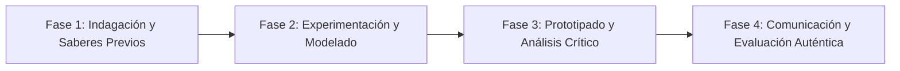

# Planeación Didáctica: La Unión Hace la Molécula: Enlaces Iónicos, Covalentes y Conductividad Eléctrica

> [!INFO] Ficha Técnica y Curricular (NEM 2024 - Fase 6)
> - **Docente Titular:** [[Prof. Israel López Ángeles]] (`usr-teacher-1`)
> - **Nivel y Fase:** Educación Secundaria — [[Fase 6 (1º, 2º y 3º de Secundaria)]]
> - **Grado:** **3º de Secundaria**
> - **Campo Formativo:** [[Saberes y Pensamiento Científico]]
> - **Disciplina / Materia:** [[Química]]
> - **Contenido Sintético Oficial SEP 2024:** *Enlaces químicos: iónico, covalente y metálico*
> - **MOC General:** [[00_Indice_Maestro_Secundaria_Fase6_NEM2024]]

---

## 🎯 Proceso de Desarrollo de Aprendizaje (PDA Oficial SEP 2024)
```text
Fase 6 (3º Secundaria) - Experimenta y diferencia compuestos iónicos, covalentes y metálicos con base en sus propiedades físicas (solubilidad, punto de fusión y conductividad eléctrica en estado sólido y disuelto).
```

---

## ❓ Preguntas Detonadoras e Indagación Crítica
- **¿Por qué la sal disuelta en agua enciende un foco (electrolito) pero el azúcar disuelto no conduce electricidad?**
- **¿Cómo determina la diferencia de electronegatividad de Pauling el tipo de enlace químico?**

---

## 📋 Secuencia Didáctica Detallada (10 Sesiones de 50 Minutos)



### 🚀 Sesiones 1 y 2: Indagación, Diagnóstico y Recuperación de Saberes
- **Inicio (15 min):** Circuito probador de conductividad con foco LED y vasos con diferentes sustancias.
- **Desarrollo (30 min):** Planteamiento del reto integrador, conformación de equipos colaborativos y delimitación del alcance del proyecto.
- **Cierre (5 min):** Registro en la bitácora individual de metas de aprendizaje.

### 🔬 Sesiones 3 a 7: Desarrollo Metodológico, Trabajo Experimental y Producción
- **Inicio (10 min):** Reactivación de compromisos y revisión del cronograma de trabajo.
- **Desarrollo (35 min):** Laboratorio de Conductividad y Enlaces: Probar conductividad en sal común ($	ext{NaCl}$), azúcar ($	ext{C}_{12}	ext{H}_{22}	ext{O}_{11}$), sulfato de cobre y aceite, clasificando los enlaces con base en la electronegatividad.
- **Cierre (5 min):** Coevaluación intermedia mediante lista de cotejo y retroalimentación entre pares.

### 🏁 Sesiones 8 a 10: Integración, Socialización Comunitaria y Evaluación
- **Inicio (10 min):** Ensayos de presentación y ajuste final de entregables.
- **Desarrollo (30 min):** Modelado molecular 3D de cristales iónicos vs moléculas covalentes.
- **Cierre (10 min):** Metacognición grupal, balance de impacto social y firma del acta de entrega de proyectos.

---

## 📊 Rúbrica Analítica de Evaluación Formativa y Auténtica

| Nivel de Desempeño | Criterios Curriculares y Evidencias Observables | Ponderación |
| :--- | :--- | :---: |
| **Excelente (10)** | Diferenciación experimental de electrolitos y no electrolitos con fundamentación teórica sólida, rigurosa y aplicación práctica contextualizada. | 40% |
| **Satisfactorio (8-9)** | Comprensión de la transferencia vs compartición de electrones de manera autónoma, estructurada y con calidad metodológica. | 35% |
| **En Proceso (6-7)** | Predicción del tipo de enlace según la escala de Pauling con apoyo docente y áreas de mejora identificadas. | 25% |

---

## 📦 Materiales, Recursos Didácticos y Entregable Final

- **Materiales y Recursos:** Circuito detector con pila y LED, sal, azúcar, agua destilada, electrodos de grafito.
- **Entregable Principal:** `Reporte de Laboratorio de Enlaces Químicos y Maqueta de Redes Cristalinas.`
- **Instrumentos de Evaluación:** Rúbrica analítica, bitácora de coevaluación entre pares, lista de verificación de entregables.

---

## 🔗 Enlaces Bidireccionales (Obsidian Knowledge Graph)
- [[00_Indice_Maestro_Secundaria_Fase6_NEM2024]]
- [[Saberes y Pensamiento Científico]]
- [[Química]]
- [[Secundaria_3er_Grado]]
- [[Prof_Israel_Lopez_Angeles]]
