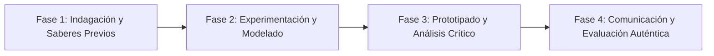

# Planeación Didáctica: La Danza de los Electrones: Reacciones Redox, Número de Oxidación y Protección Galvánica

> [!INFO] Ficha Técnica y Curricular (NEM 2024 - Fase 6)
> - **Docente Titular:** [[Prof. Israel López Ángeles]] (`usr-teacher-1`)
> - **Nivel y Fase:** Educación Secundaria — [[Fase 6 (1º, 2º y 3º de Secundaria)]]
> - **Grado:** **3º de Secundaria**
> - **Campo Formativo:** [[Saberes y Pensamiento Científico]]
> - **Disciplina / Materia:** [[Química]]
> - **Contenido Sintético Oficial SEP 2024:** *Reacciones de óxido-reducción (Redox) y corrosión*
> - **MOC General:** [[00_Indice_Maestro_Secundaria_Fase6_NEM2024]]

---

## 🎯 Proceso de Desarrollo de Aprendizaje (PDA Oficial SEP 2024)
```text
Fase 6 (3º Secundaria) - Identifica reacciones redox en el entorno (combustión, respiración celular, corrosión de metales), asigna números de oxidación y determina el agente oxidante y reductor.
```

---

## ❓ Preguntas Detonadoras e Indagación Crítica
- **¿Por qué un clavo de hierro se oxida al aire libre perdiendo electrones mientras el oxígeno se reduce?**
- **¿Cómo protegen los ánodos de sacrificio de zinc el casco de los barcos y las tuberías de gas?**

---

## 📋 Secuencia Didáctica Detallada (10 Sesiones de 50 Minutos)



### 🚀 Sesiones 1 y 2: Indagación, Diagnóstico y Recuperación de Saberes
- **Inicio (15 min):** Reacción de una manzana cortada oscureciéndose por oxidación enzimática vs tratada con jugo de limón.
- **Desarrollo (30 min):** Planteamiento del reto integrador, conformación de equipos colaborativos y delimitación del alcance del proyecto.
- **Cierre (5 min):** Registro en la bitácora individual de metas de aprendizaje.

### 🔬 Sesiones 3 a 7: Desarrollo Metodológico, Trabajo Experimental y Producción
- **Inicio (10 min):** Reactivación de compromisos y revisión del cronograma de trabajo.
- **Desarrollo (35 min):** Laboratorio de Redox y Electroquímica: Sumergir clavos de hierro en solución de sulfato de cobre observando el depósito de cobre metálico ($Fe + Cu^{2+} \rightarrow Fe^{2+} + Cu$), asignando números de oxidación.
- **Cierre (5 min):** Coevaluación intermedia mediante lista de cotejo y retroalimentación entre pares.

### 🏁 Sesiones 8 a 10: Integración, Socialización Comunitaria y Evaluación
- **Inicio (10 min):** Ensayos de presentación y ajuste final de entregables.
- **Desarrollo (30 min):** Balanceo de una reacción redox sencilla por método de cambio de número de oxidación.
- **Cierre (10 min):** Metacognición grupal, balance de impacto social y firma del acta de entrega de proyectos.

---

## 📊 Rúbrica Analítica de Evaluación Formativa y Auténtica

| Nivel de Desempeño | Criterios Curriculares y Evidencias Observables | Ponderación |
| :--- | :--- | :---: |
| **Excelente (10)** | Asignación correcta de números de oxidación a elementos y compuestos con fundamentación teórica sólida, rigurosa y aplicación práctica contextualizada. | 40% |
| **Satisfactorio (8-9)** | Identificación precisa de la especie oxidada, reducida y agentes redox de manera autónoma, estructurada y con calidad metodológica. | 35% |
| **En Proceso (6-7)** | Comprensión de aplicaciones industriales y prevención de la corrosión con apoyo docente y áreas de mejora identificadas. | 25% |

---

## 📦 Materiales, Recursos Didácticos y Entregable Final

- **Materiales y Recursos:** Sulfato de cobre, clavos de hierro limpios, ácido clorhídrico diluido, manzana.
- **Entregable Principal:** `Reporte Experimental de Reacciones Redox y Guía de Prevención de la Corrosión.`
- **Instrumentos de Evaluación:** Rúbrica analítica, bitácora de coevaluación entre pares, lista de verificación de entregables.

---

## 🔗 Enlaces Bidireccionales (Obsidian Knowledge Graph)
- [[00_Indice_Maestro_Secundaria_Fase6_NEM2024]]
- [[Saberes y Pensamiento Científico]]
- [[Química]]
- [[Secundaria_3er_Grado]]
- [[Prof_Israel_Lopez_Angeles]]
