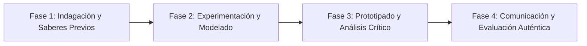

# Planeación Didáctica: La Red Inclusiva: Desarrollo Web con HTML5, Accesibilidad Digital y Hojas de Estilo CSS

> [!INFO] Ficha Técnica y Curricular (NEM 2024 - Fase 6)
> - **Docente Titular:** [[Prof. Israel López Ángeles]] (`usr-teacher-1`)
> - **Nivel y Fase:** Educación Secundaria — [[Fase 6 (1º, 2º y 3º de Secundaria)]]
> - **Grado:** **3º de Secundaria**
> - **Campo Formativo:** [[De lo Humano y lo Comunitario]]
> - **Disciplina / Materia:** [[Tecnología]]
> - **Contenido Sintético Oficial SEP 2024:** *Diseño web accesible, código HTML/CSS y alfabetización digital*
> - **MOC General:** [[00_Indice_Maestro_Secundaria_Fase6_NEM2024]]

---

## 🎯 Proceso de Desarrollo de Aprendizaje (PDA Oficial SEP 2024)
```text
Fase 6 (3º Secundaria) - Diseña y programa una página web básica con HTML5 y CSS que cumpla con pautas de accesibilidad web (contraste adecuado, etiquetas alt para imágenes, tipografías legibles).
```

---

## ❓ Preguntas Detonadoras e Indagación Crítica
- **¿Cómo permite el código HTML5 estructurar la información para que un lector de pantalla para personas ciegas la interprete con claridad?**
- **¿Por qué la accesibilidad digital es un derecho humano en la era de la información?**

---

## 📋 Secuencia Didáctica Detallada (10 Sesiones de 50 Minutos)



### 🚀 Sesiones 1 y 2: Indagación, Diagnóstico y Recuperación de Saberes
- **Inicio (15 min):** Inspección de código fuente de una página web en el navegador.
- **Desarrollo (30 min):** Planteamiento del reto integrador, conformación de equipos colaborativos y delimitación del alcance del proyecto.
- **Cierre (5 min):** Registro en la bitácora individual de metas de aprendizaje.

### 🔬 Sesiones 3 a 7: Desarrollo Metodológico, Trabajo Experimental y Producción
- **Inicio (10 min):** Reactivación de compromisos y revisión del cronograma de trabajo.
- **Desarrollo (35 min):** Taller de Programación Web Inclusiva: Escribir la estructura de una página informativa escolar con etiquetas semánticas (`<header>`, `<nav>`, `<article>`, `<footer>`) y aplicar estilos CSS responsivos y accesibles.
- **Cierre (5 min):** Coevaluación intermedia mediante lista de cotejo y retroalimentación entre pares.

### 🏁 Sesiones 8 a 10: Integración, Socialización Comunitaria y Evaluación
- **Inicio (10 min):** Ensayos de presentación y ajuste final de entregables.
- **Desarrollo (30 min):** Validación de accesibilidad con herramientas en línea y publicación local.
- **Cierre (10 min):** Metacognición grupal, balance de impacto social y firma del acta de entrega de proyectos.

---

## 📊 Rúbrica Analítica de Evaluación Formativa y Auténtica

| Nivel de Desempeño | Criterios Curriculares y Evidencias Observables | Ponderación |
| :--- | :--- | :---: |
| **Excelente (10)** | Uso correcto de etiquetas semánticas de HTML5 y reglas de estilo CSS con fundamentación teórica sólida, rigurosa y aplicación práctica contextualizada. | 40% |
| **Satisfactorio (8-9)** | Cumplimiento de estándares de accesibilidad digital básica de manera autónoma, estructurada y con calidad metodológica. | 35% |
| **En Proceso (6-7)** | Diseño limpio, ordenado y funcional con apoyo docente y áreas de mejora identificadas. | 25% |

---

## 📦 Materiales, Recursos Didácticos y Entregable Final

- **Materiales y Recursos:** Computadoras con editor de código (VS Code o Bloc de Notas), navegadores web.
- **Entregable Principal:** `Página Web Accesible Programada en HTML5/CSS sobre una Causa Comunitaria.`
- **Instrumentos de Evaluación:** Rúbrica analítica, bitácora de coevaluación entre pares, lista de verificación de entregables.

---

## 🔗 Enlaces Bidireccionales (Obsidian Knowledge Graph)
- [[00_Indice_Maestro_Secundaria_Fase6_NEM2024]]
- [[De lo Humano y lo Comunitario]]
- [[Tecnología]]
- [[Secundaria_3er_Grado]]
- [[Prof_Israel_Lopez_Angeles]]
