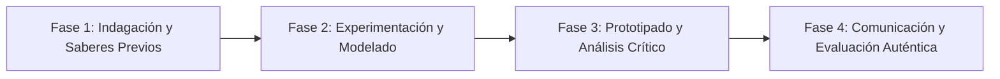

# Planeación Didáctica: Hogar Inteligente: Sensores de Gas, Alarma Antirrobo y Ahorro Energético con Domótica

> [!INFO] Ficha Técnica y Curricular (NEM 2024 - Fase 6)
> - **Docente Titular:** [[Prof. Israel López Ángeles]] (`usr-teacher-1`)
> - **Nivel y Fase:** Educación Secundaria — [[Fase 6 (1º, 2º y 3º de Secundaria)]]
> - **Grado:** **3º de Secundaria**
> - **Campo Formativo:** [[De lo Humano y lo Comunitario]]
> - **Disciplina / Materia:** [[Tecnología]]
> - **Contenido Sintético Oficial SEP 2024:** *Domótica básica y automatización del hogar con microcontroladores*
> - **MOC General:** [[00_Indice_Maestro_Secundaria_Fase6_NEM2024]]

---

## 🎯 Proceso de Desarrollo de Aprendizaje (PDA Oficial SEP 2024)
```text
Fase 6 (3º Secundaria) - Construye y programa un prototipo domótico con microcontrolador (Arduino/ESP32) integrando sensores de gas MQ-2, sensor de movimiento PIR y relevador para corte automático.
```

---

## ❓ Preguntas Detonadoras e Indagación Crítica
- **¿Cómo puede la domótica prevenir explosiones por fugas de gas doméstico cortando el suministro automáticamente?**
- **¿Cómo programamos una alarma antirrobo con sensor infrarrojo y zumbador piezoeléctrico?**

---

## 📋 Secuencia Didáctica Detallada (10 Sesiones de 50 Minutos)



### 🚀 Sesiones 1 y 2: Indagación, Diagnóstico y Recuperación de Saberes
- **Inicio (15 min):** Demostración de detección de gas de un encendedor cerca de un sensor MQ-2.
- **Desarrollo (30 min):** Planteamiento del reto integrador, conformación de equipos colaborativos y delimitación del alcance del proyecto.
- **Cierre (5 min):** Registro en la bitácora individual de metas de aprendizaje.

### 🔬 Sesiones 3 a 7: Desarrollo Metodológico, Trabajo Experimental y Producción
- **Inicio (10 min):** Reactivación de compromisos y revisión del cronograma de trabajo.
- **Desarrollo (35 min):** Laboratorio de Domótica Escolar: Conectar y calibrar en protoboard el sensor de gas MQ-2 y el sensor PIR, programando en C++/bloques la activación de una alarma acústica y el apagado de luces cuando no hay personas.
- **Cierre (5 min):** Coevaluación intermedia mediante lista de cotejo y retroalimentación entre pares.

### 🏁 Sesiones 8 a 10: Integración, Socialización Comunitaria y Evaluación
- **Inicio (10 min):** Ensayos de presentación y ajuste final de entregables.
- **Desarrollo (30 min):** Montaje del circuito en una maqueta de vivienda inteligente.
- **Cierre (10 min):** Metacognición grupal, balance de impacto social y firma del acta de entrega de proyectos.

---

## 📊 Rúbrica Analítica de Evaluación Formativa y Auténtica

| Nivel de Desempeño | Criterios Curriculares y Evidencias Observables | Ponderación |
| :--- | :--- | :---: |
| **Excelente (10)** | Cableado correcto de entradas analógicas y salidas digitales con fundamentación teórica sólida, rigurosa y aplicación práctica contextualizada. | 40% |
| **Satisfactorio (8-9)** | Programación lógica con umbrales de detección y temporizadores de manera autónoma, estructurada y con calidad metodológica. | 35% |
| **En Proceso (6-7)** | Aplicación de la tecnología en la seguridad y el ahorro energético con apoyo docente y áreas de mejora identificadas. | 25% |

---

## 📦 Materiales, Recursos Didácticos y Entregable Final

- **Materiales y Recursos:** Arduino Uno, sensor de gas MQ-2, sensor PIR, buzzer, relé de 5V, LEDs.
- **Entregable Principal:** `Maqueta Domótica Funcional con Alarma de Gas y Sensor de Movimiento.`
- **Instrumentos de Evaluación:** Rúbrica analítica, bitácora de coevaluación entre pares, lista de verificación de entregables.

---

## 🔗 Enlaces Bidireccionales (Obsidian Knowledge Graph)
- [[00_Indice_Maestro_Secundaria_Fase6_NEM2024]]
- [[De lo Humano y lo Comunitario]]
- [[Tecnología]]
- [[Secundaria_3er_Grado]]
- [[Prof_Israel_Lopez_Angeles]]
