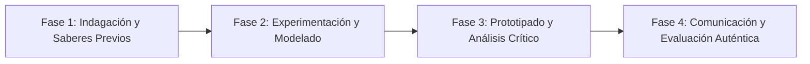

# Planeación Didáctica: Rumbo al Futuro: Orientación Vocacional, Oferta de Bachilleratos y Elección Consciente

> [!INFO] Ficha Técnica y Curricular (NEM 2024 - Fase 6)
> - **Docente Titular:** [[Prof. Israel López Ángeles]] (`usr-teacher-1`)
> - **Nivel y Fase:** Educación Secundaria — [[Fase 6 (1º, 2º y 3º de Secundaria)]]
> - **Grado:** **3º de Secundaria**
> - **Campo Formativo:** [[De lo Humano y lo Comunitario]]
> - **Disciplina / Materia:** [[Tutoría / Educación Socioemocional]]
> - **Contenido Sintético Oficial SEP 2024:** *Orientación vocacional y toma de decisiones para Educación Media Superior*
> - **MOC General:** [[00_Indice_Maestro_Secundaria_Fase6_NEM2024]]

---

## 🎯 Proceso de Desarrollo de Aprendizaje (PDA Oficial SEP 2024)
```text
Fase 6 (3º Secundaria) - Visualiza su proyecto de vida y toma decisiones informadas para el ingreso a la Educación Media Superior (Bachillerato General, Tecnológico, Profesional Técnico), evaluando aptitudes e intereses vocacionales.
```

---

## ❓ Preguntas Detonadoras e Indagación Crítica
- **¿Cuáles son tus áreas de mayor afinidad: Físico-Matemáticas, Químico-Biológicas, Ciencias Sociales o Humanidades y Artes?**
- **¿Qué opciones de bachillerato existen en tu región (UNAM, IPN, CONALEP, DGETI, Bachilleres, Telebachillerato)?**
- **¿Cómo elegir una opción educativa con base en tus talentos auténticos y no por moda o presión social?**

---

## 📋 Secuencia Didáctica Detallada (10 Sesiones de 50 Minutos)



### 🚀 Sesiones 1 y 2: Indagación, Diagnóstico y Recuperación de Saberes
- **Inicio (15 min):** Aplicación del Test de Intereses y Aptitudes Vocacionales de Holland / Herrera y Montes.
- **Desarrollo (30 min):** Planteamiento del reto integrador, conformación de equipos colaborativos y delimitación del alcance del proyecto.
- **Cierre (5 min):** Registro en la bitácora individual de metas de aprendizaje.

### 🔬 Sesiones 3 a 7: Desarrollo Metodológico, Trabajo Experimental y Producción
- **Inicio (10 min):** Reactivación de compromisos y revisión del cronograma de trabajo.
- **Desarrollo (35 min):** Feria Vocacional Escolar: Investigar planes de estudio, perfiles de egreso y requisitos de ingreso de 3 instituciones de media superior, elaborando un cuadro comparativo vocacional.
- **Cierre (5 min):** Coevaluación intermedia mediante lista de cotejo y retroalimentación entre pares.

### 🏁 Sesiones 8 a 10: Integración, Socialización Comunitaria y Evaluación
- **Inicio (10 min):** Ensayos de presentación y ajuste final de entregables.
- **Desarrollo (30 min):** Presentación de la Ruta de Elección Vocacional ante los padres de familia.
- **Cierre (10 min):** Metacognición grupal, balance de impacto social y firma del acta de entrega de proyectos.

---

## 📊 Rúbrica Analítica de Evaluación Formativa y Auténtica

| Nivel de Desempeño | Criterios Curriculares y Evidencias Observables | Ponderación |
| :--- | :--- | :---: |
| **Excelente (10)** | Interpretación de resultados del perfil de intereses y aptitudes vocacionales con fundamentación teórica sólida, rigurosa y aplicación práctica contextualizada. | 40% |
| **Satisfactorio (8-9)** | Investigación rigurosa de la oferta educativa de nivel medio superior de manera autónoma, estructurada y con calidad metodológica. | 35% |
| **En Proceso (6-7)** | Toma de decisiones vocacionales autónoma, informada y responsable con apoyo docente y áreas de mejora identificadas. | 25% |

---

## 📦 Materiales, Recursos Didácticos y Entregable Final

- **Materiales y Recursos:** Cuestionarios vocacionales, guías de ingreso a media superior (COMIPEMS / estatales).
- **Entregable Principal:** `Expediente de Orientación Vocacional y Cuadro Comparativo de Opciones de Bachillerato.`
- **Instrumentos de Evaluación:** Rúbrica analítica, bitácora de coevaluación entre pares, lista de verificación de entregables.

---

## 🔗 Enlaces Bidireccionales (Obsidian Knowledge Graph)
- [[00_Indice_Maestro_Secundaria_Fase6_NEM2024]]
- [[De lo Humano y lo Comunitario]]
- [[Tutoría / Educación Socioemocional]]
- [[Secundaria_3er_Grado]]
- [[Prof_Israel_Lopez_Angeles]]
