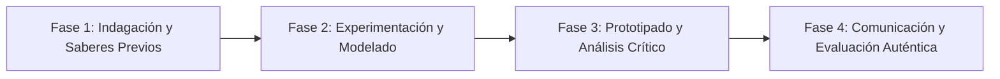

# Planeación Didáctica: Redes de Vida: Salud Mental, Primeros Auxilios Psicológicos y Líneas de Ayuda

> [!INFO] Ficha Técnica y Curricular (NEM 2024 - Fase 6)
> - **Docente Titular:** [[Prof. Israel López Ángeles]] (`usr-teacher-1`)
> - **Nivel y Fase:** Educación Secundaria — [[Fase 6 (1º, 2º y 3º de Secundaria)]]
> - **Grado:** **3º de Secundaria**
> - **Campo Formativo:** [[De lo Humano y lo Comunitario]]
> - **Disciplina / Materia:** [[Tutoría / Educación Socioemocional]]
> - **Contenido Sintético Oficial SEP 2024:** *Prevención de conductas de riesgo, autolesiones y salud mental comunitaria*
> - **MOC General:** [[00_Indice_Maestro_Secundaria_Fase6_NEM2024]]

---

## 🎯 Proceso de Desarrollo de Aprendizaje (PDA Oficial SEP 2024)
```text
Fase 6 (3º Secundaria) - Reflexiona sobre las condiciones que representan riesgo para la salud mental (depresión, ansiedad, autolesiones) y promueve estrategias de autocuidado, redes de apoyo y primeros auxilios emocionales.
```

---

## ❓ Preguntas Detonadoras e Indagación Crítica
- **¿Por qué hablar de salud mental, tristeza profunda o ansiedad debe dejar de ser un tabú en la escuela y el hogar?**
- **¿Cómo identificamos señales de alerta en un amigo que está sufriendo en silencio?**
- **¿Cómo brindamos Primeros Auxilios Psicológicos (Escuchar sin juzgar, acompañar, conectar con un profesional)?**

---

## 📋 Secuencia Didáctica Detallada (10 Sesiones de 50 Minutos)



### 🚀 Sesiones 1 y 2: Indagación, Diagnóstico y Recuperación de Saberes
- **Inicio (15 min):** Dinámica de la Caja de Preguntas Anónimas sobre miedos y bienestar emocional.
- **Desarrollo (30 min):** Planteamiento del reto integrador, conformación de equipos colaborativos y delimitación del alcance del proyecto.
- **Cierre (5 min):** Registro en la bitácora individual de metas de aprendizaje.

### 🔬 Sesiones 3 a 7: Desarrollo Metodológico, Trabajo Experimental y Producción
- **Inicio (10 min):** Reactivación de compromisos y revisión del cronograma de trabajo.
- **Desarrollo (35 min):** Taller de Guardianes de la Vida: Aprender el protocolo de escucha empática, identificar factores de riesgo y crear el directorio de líneas gratuitas de apoyo emocional (Línea de la Vida 800 911 2000, Locatel, UNAM).
- **Cierre (5 min):** Coevaluación intermedia mediante lista de cotejo y retroalimentación entre pares.

### 🏁 Sesiones 8 a 10: Integración, Socialización Comunitaria y Evaluación
- **Inicio (10 min):** Ensayos de presentación y ajuste final de entregables.
- **Desarrollo (30 min):** Campaña escolar de salud mental: "No estás solo, tu vida importa".
- **Cierre (10 min):** Metacognición grupal, balance de impacto social y firma del acta de entrega de proyectos.

---

## 📊 Rúbrica Analítica de Evaluación Formativa y Auténtica

| Nivel de Desempeño | Criterios Curriculares y Evidencias Observables | Ponderación |
| :--- | :--- | :---: |
| **Excelente (10)** | Comprensión de los factores que inciden en la salud mental adolescente con fundamentación teórica sólida, rigurosa y aplicación práctica contextualizada. | 40% |
| **Satisfactorio (8-9)** | Capacidad de escucha empática y aplicación de primeros auxilios psicológicos básicos de manera autónoma, estructurada y con calidad metodológica. | 35% |
| **En Proceso (6-7)** | Identificación y difusión de canales profesionales de ayuda inmediata con apoyo docente y áreas de mejora identificadas. | 25% |

---

## 📦 Materiales, Recursos Didácticos y Entregable Final

- **Materiales y Recursos:** Guías de salud mental de UNICEF y Secretaría de Salud, cartulinas, tarjetas de apoyo.
- **Entregable Principal:** `Directorio Escolar de Salud Mental y Manual de Guardianes de Apoyo Emocional.`
- **Instrumentos de Evaluación:** Rúbrica analítica, bitácora de coevaluación entre pares, lista de verificación de entregables.

---

## 🔗 Enlaces Bidireccionales (Obsidian Knowledge Graph)
- [[00_Indice_Maestro_Secundaria_Fase6_NEM2024]]
- [[De lo Humano y lo Comunitario]]
- [[Tutoría / Educación Socioemocional]]
- [[Secundaria_3er_Grado]]
- [[Prof_Israel_Lopez_Angeles]]
