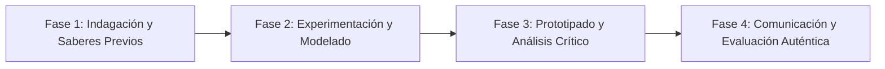

# Planeación Didáctica: La Encrucijada Moral: Dilemas Éticos, Valores y Toma de Decisiones Responsables

> [!INFO] Ficha Técnica y Curricular (NEM 2024 - Fase 6)
> - **Docente Titular:** [[Prof. Israel López Ángeles]] (`usr-teacher-1`)
> - **Nivel y Fase:** Educación Secundaria — [[Fase 6 (1º, 2º y 3º de Secundaria)]]
> - **Grado:** **3º de Secundaria**
> - **Campo Formativo:** [[De lo Humano y lo Comunitario]]
> - **Disciplina / Materia:** [[Tutoría / Educación Socioemocional]]
> - **Contenido Sintético Oficial SEP 2024:** *Toma de decisiones éticas y dilemas morales en la juventud*
> - **MOC General:** [[00_Indice_Maestro_Secundaria_Fase6_NEM2024]]

---

## 🎯 Proceso de Desarrollo de Aprendizaje (PDA Oficial SEP 2024)
```text
Fase 6 (3º Secundaria) - Resuelve dilemas morales complejos evaluando principios éticos, consecuencias individuales y colectivas, y la congruencia entre lo que se piensa, se dice y se hace.
```

---

## ❓ Preguntas Detonadoras e Indagación Crítica
- **¿Qué harías si un amigo te pide encubrir una falta grave que afecta a otros compañeros?**
- **¿Cómo aplicamos el Principio del Imperativo Categórico de Kant (actúa de modo que tu acción pueda ser ley universal)?**

---

## 📋 Secuencia Didáctica Detallada (10 Sesiones de 50 Minutos)



### 🚀 Sesiones 1 y 2: Indagación, Diagnóstico y Recuperación de Saberes
- **Inicio (15 min):** Planteamiento del clásico Dilema de Heinz (el medicamento robado para salvar una vida).
- **Desarrollo (30 min):** Planteamiento del reto integrador, conformación de equipos colaborativos y delimitación del alcance del proyecto.
- **Cierre (5 min):** Registro en la bitácora individual de metas de aprendizaje.

### 🔬 Sesiones 3 a 7: Desarrollo Metodológico, Trabajo Experimental y Producción
- **Inicio (10 min):** Reactivación de compromisos y revisión del cronograma de trabajo.
- **Desarrollo (35 min):** Taller de Juicio Moral de Kohlberg: Analizar en equipos 3 dilemas éticos juveniles reales, identificando valores en conflicto (lealtad vs justicia, beneficio propio vs bien común) y fundamentando la decisión.
- **Cierre (5 min):** Coevaluación intermedia mediante lista de cotejo y retroalimentación entre pares.

### 🏁 Sesiones 8 a 10: Integración, Socialización Comunitaria y Evaluación
- **Inicio (10 min):** Ensayos de presentación y ajuste final de entregables.
- **Desarrollo (30 min):** Construcción del "Árbol de Decisiones Éticas" del salón.
- **Cierre (10 min):** Metacognición grupal, balance de impacto social y firma del acta de entrega de proyectos.

---

## 📊 Rúbrica Analítica de Evaluación Formativa y Auténtica

| Nivel de Desempeño | Criterios Curriculares y Evidencias Observables | Ponderación |
| :--- | :--- | :---: |
| **Excelente (10)** | Capacidad de argumentación en niveles superiores de juicio moral con fundamentación teórica sólida, rigurosa y aplicación práctica contextualizada. | 40% |
| **Satisfactorio (8-9)** | Identificación de consecuencias a corto y largo plazo de las decisiones de manera autónoma, estructurada y con calidad metodológica. | 35% |
| **En Proceso (6-7)** | Congruencia ética y responsabilidad ciudadana con apoyo docente y áreas de mejora identificadas. | 25% |

---

## 📦 Materiales, Recursos Didácticos y Entregable Final

- **Materiales y Recursos:** Fichas de dilemas morales, esquemas de árbol de decisiones.
- **Entregable Principal:** `Matriz de Resolución de Dilemas Éticos y Carta de Principios Morales Personales.`
- **Instrumentos de Evaluación:** Rúbrica analítica, bitácora de coevaluación entre pares, lista de verificación de entregables.

---

## 🔗 Enlaces Bidireccionales (Obsidian Knowledge Graph)
- [[00_Indice_Maestro_Secundaria_Fase6_NEM2024]]
- [[De lo Humano y lo Comunitario]]
- [[Tutoría / Educación Socioemocional]]
- [[Secundaria_3er_Grado]]
- [[Prof_Israel_Lopez_Angeles]]
