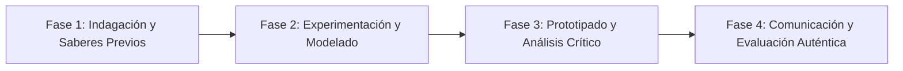

# Planeación Didáctica: Finanzas para la Vida: Presupuesto Personal, Ahorro Inteligente y Metas Económicas

> [!INFO] Ficha Técnica y Curricular (NEM 2024 - Fase 6)
> - **Docente Titular:** [[Prof. Israel López Ángeles]] (`usr-teacher-1`)
> - **Nivel y Fase:** Educación Secundaria — [[Fase 6 (1º, 2º y 3º de Secundaria)]]
> - **Grado:** **3º de Secundaria**
> - **Campo Formativo:** [[De lo Humano y lo Comunitario]]
> - **Disciplina / Materia:** [[Tutoría / Educación Socioemocional]]
> - **Contenido Sintético Oficial SEP 2024:** *Educación financiera para adolescentes: ahorro, presupuesto y consumo inteligente*
> - **MOC General:** [[00_Indice_Maestro_Secundaria_Fase6_NEM2024]]

---

## 🎯 Proceso de Desarrollo de Aprendizaje (PDA Oficial SEP 2024)
```text
Fase 6 (3º Secundaria) - Diseña un presupuesto personal y familiar mensual (ingresos, gastos fijos, variables y ahorro), analiza el funcionamiento del interés compuesto y promueve el consumo crítico frente a la publicidad.
```

---

## ❓ Preguntas Detonadoras e Indagación Crítica
- **¿Qué diferencia a un "Gasto Hormiga" (antojos diarios) de una inversión que genera valor a largo plazo?**
- **¿Cómo se aplica la regla de ahorro 50-30-20 (50% necesidades, 30% gustos, 20% ahorro)?**
- **¿Qué es el interés compuesto y cómo hace crecer los ahorros con el tiempo?**

---

## 📋 Secuencia Didáctica Detallada (10 Sesiones de 50 Minutos)



### 🚀 Sesiones 1 y 2: Indagación, Diagnóstico y Recuperación de Saberes
- **Inicio (15 min):** Cálculo del costo acumulado anual de comprar un refresco y botana diarios ($15,000+ pesos).
- **Desarrollo (30 min):** Planteamiento del reto integrador, conformación de equipos colaborativos y delimitación del alcance del proyecto.
- **Cierre (5 min):** Registro en la bitácora individual de metas de aprendizaje.

### 🔬 Sesiones 3 a 7: Desarrollo Metodológico, Trabajo Experimental y Producción
- **Inicio (10 min):** Reactivación de compromisos y revisión del cronograma de trabajo.
- **Desarrollo (35 min):** Taller de Educación Financiera Juvenil: Elaborar un simulador de presupuesto mensual en hoja de cálculo, fijar una meta de ahorro a 6 meses y comparar opciones formales de cuentas de ahorro para jóvenes (CetesDirecto Niños).
- **Cierre (5 min):** Coevaluación intermedia mediante lista de cotejo y retroalimentación entre pares.

### 🏁 Sesiones 8 a 10: Integración, Socialización Comunitaria y Evaluación
- **Inicio (10 min):** Ensayos de presentación y ajuste final de entregables.
- **Desarrollo (30 min):** Debate sobre la trampa de las compras a crédito impulsivas y tarjetas bancarias.
- **Cierre (10 min):** Metacognición grupal, balance de impacto social y firma del acta de entrega de proyectos.

---

## 📊 Rúbrica Analítica de Evaluación Formativa y Auténtica

| Nivel de Desempeño | Criterios Curriculares y Evidencias Observables | Ponderación |
| :--- | :--- | :---: |
| **Excelente (10)** | Estructuración técnica de presupuestos con balance equilibrado con fundamentación teórica sólida, rigurosa y aplicación práctica contextualizada. | 40% |
| **Satisfactorio (8-9)** | Identificación de estrategias para eliminar gastos innecesarios de manera autónoma, estructurada y con calidad metodológica. | 35% |
| **En Proceso (6-7)** | Toma de decisiones financieras informadas y responsables con apoyo docente y áreas de mejora identificadas. | 25% |

---

## 📦 Materiales, Recursos Didácticos y Entregable Final

- **Materiales y Recursos:** Calculadoras, hojas de cálculo, formatos de presupuesto mensual.
- **Entregable Principal:** `Presupuesto Mensual Personalizado y Plan de Ahorro con Metodología 50-30-20.`
- **Instrumentos de Evaluación:** Rúbrica analítica, bitácora de coevaluación entre pares, lista de verificación de entregables.

---

## 🔗 Enlaces Bidireccionales (Obsidian Knowledge Graph)
- [[00_Indice_Maestro_Secundaria_Fase6_NEM2024]]
- [[De lo Humano y lo Comunitario]]
- [[Tutoría / Educación Socioemocional]]
- [[Secundaria_3er_Grado]]
- [[Prof_Israel_Lopez_Angeles]]
