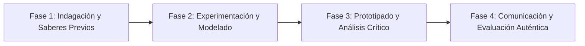

# Planeación Didáctica: Líderes que Inspiran: Liderazgo Servicial, Inteligencia Colectiva y Sinergia de Grupo

> [!INFO] Ficha Técnica y Curricular (NEM 2024 - Fase 6)
> - **Docente Titular:** [[Prof. Israel López Ángeles]] (`usr-teacher-1`)
> - **Nivel y Fase:** Educación Secundaria — [[Fase 6 (1º, 2º y 3º de Secundaria)]]
> - **Grado:** **3º de Secundaria**
> - **Campo Formativo:** [[De lo Humano y lo Comunitario]]
> - **Disciplina / Materia:** [[Tutoría / Educación Socioemocional]]
> - **Contenido Sintético Oficial SEP 2024:** *Liderazgo positivo, trabajo en equipo y habilidades para el siglo XXI*
> - **MOC General:** [[00_Indice_Maestro_Secundaria_Fase6_NEM2024]]

---

## 🎯 Proceso de Desarrollo de Aprendizaje (PDA Oficial SEP 2024)
```text
Fase 6 (3º Secundaria) - Desarrolla habilidades de liderazgo servicial y trabajo en equipo (distribución equitativa de roles, delegación, retroalimentación constructiva y resolución ágil de desacuerdos) para coordinar proyectos comunitarios.
```

---

## ❓ Preguntas Detonadoras e Indagación Crítica
- **¿Qué diferencia a un jefe autoritario que da órdenes de un líder empático que escucha, sirve y potencia los talentos de su equipo?**
- **¿Qué es la SINERGIA (el todo es mayor que la suma de sus partes)?**

---

## 📋 Secuencia Didáctica Detallada (10 Sesiones de 50 Minutos)



### 🚀 Sesiones 1 y 2: Indagación, Diagnóstico y Recuperación de Saberes
- **Inicio (15 min):** Reto de la Torre de Malvavisco y Espaguetis (Marshmallow Challenge) en equipos de 4.
- **Desarrollo (30 min):** Planteamiento del reto integrador, conformación de equipos colaborativos y delimitación del alcance del proyecto.
- **Cierre (5 min):** Registro en la bitácora individual de metas de aprendizaje.

### 🔬 Sesiones 3 a 7: Desarrollo Metodológico, Trabajo Experimental y Producción
- **Inicio (10 min):** Reactivación de compromisos y revisión del cronograma de trabajo.
- **Desarrollo (35 min):** Taller de Dinámicas de Alto Desempeño: Evaluar el rol asumido en el reto (coordinador, diseñador, ejecutor, mediador), analizar la matriz de roles de Belbin y planear una estrategia de mejora del clima grupal.
- **Cierre (5 min):** Coevaluación intermedia mediante lista de cotejo y retroalimentación entre pares.

### 🏁 Sesiones 8 a 10: Integración, Socialización Comunitaria y Evaluación
- **Inicio (10 min):** Ensayos de presentación y ajuste final de entregables.
- **Desarrollo (30 min):** Compromiso de liderazgo positivo en las actividades de graduación escolar.
- **Cierre (10 min):** Metacognición grupal, balance de impacto social y firma del acta de entrega de proyectos.

---

## 📊 Rúbrica Analítica de Evaluación Formativa y Auténtica

| Nivel de Desempeño | Criterios Curriculares y Evidencias Observables | Ponderación |
| :--- | :--- | :---: |
| **Excelente (10)** | Demostración de actitudes de liderazgo empático y colaborativo con fundamentación teórica sólida, rigurosa y aplicación práctica contextualizada. | 40% |
| **Satisfactorio (8-9)** | Capacidad de adaptación y resolución ágil de retos en equipo de manera autónoma, estructurada y con calidad metodológica. | 35% |
| **En Proceso (6-7)** | Evaluación constructiva del desempeño propio y grupal con apoyo docente y áreas de mejora identificadas. | 25% |

---

## 📦 Materiales, Recursos Didácticos y Entregable Final

- **Materiales y Recursos:** Espaguetis crudos, malvaviscos, cinta adhesiva, cronómetros.
- **Entregable Principal:** `Diagnóstico de Roles de Equipo de Belbin y Decálogo del Liderazgo Servicial.`
- **Instrumentos de Evaluación:** Rúbrica analítica, bitácora de coevaluación entre pares, lista de verificación de entregables.

---

## 🔗 Enlaces Bidireccionales (Obsidian Knowledge Graph)
- [[00_Indice_Maestro_Secundaria_Fase6_NEM2024]]
- [[De lo Humano y lo Comunitario]]
- [[Tutoría / Educación Socioemocional]]
- [[Secundaria_3er_Grado]]
- [[Prof_Israel_Lopez_Angeles]]
