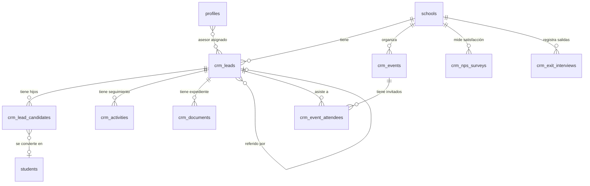

# Esquema de Base de Datos — CRM Escolar ISkool

> **Módulo:** Admisiones, Retención y Gestión de Matrícula  
> **Base de datos:** PostgreSQL (Supabase)  
> **Aislamiento:** Multi-inquilino por `school_id`  

## Diagrama de Relaciones

## Tablas

### Fase 1: Core

| Tabla | Descripción | FK Principal |
|---|---|---|
| `crm_leads` | Prospecto familiar (tutor con N hijos) | `schools.id` |
| `crm_lead_candidates` | Hijo/alumno candidato | `crm_leads.id` |
| `crm_activities` | Bitácora de seguimiento (llamadas, visitas, notas) | `crm_leads.id` |
| `crm_documents` | Expediente digital de admisión | `crm_leads.id` |

### Fase 2: Captación

| Tabla | Descripción | FK Principal |
|---|---|---|
| `crm_events` | Eventos de captación (Open House, ferias) | `schools.id` |
| `crm_event_attendees` | Asistentes a eventos | `crm_events.id` |

### Fase 3: Retención

| Tabla | Descripción | FK Principal |
|---|---|---|
| `crm_nps_surveys` | Encuestas NPS de satisfacción | `schools.id` |
| `crm_exit_interviews` | Entrevistas de salida por baja | `schools.id` |

## Referencia SQL

Ver archivo: [[schema_crm.sql]]
